# JavaScript Reference data types

# INDEX
  1. [함수](#1-함수)
  2. [객체](#2-객체)
  3. [배열](#3-배열)

 
 

# 1. 함수

## 개요

### Function
  - 참조 자료형에 속하며 모든 함수는 Function object

### 참조 자료형(Reference type)
  - Objects (Object, Array, Function)
  - 객체의 주소가 저장되는 자료형 (가변, 주소가 복사)

## 함수 정의

### 함수 구조
  - 함수의 이름
  - 함수의 매개변수
  - 함수의 body를 구성하는 statement
  - return 값이 없다면 undefined를 반환 
  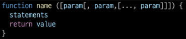

### 함수 정의 2가지 방법
  1. 선언식(function declaration)
      - 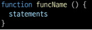
      - 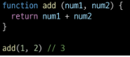
  2. 표현식(function expression)
      - 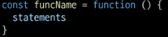
      - 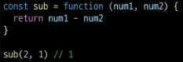

### 함수 표현식 특징
  - 함수 이름이 없는 '익명 함수'를 사용할 수 있음
  - 선언식과 달리 표현식으로 정의한 함수는 **호이스팅 되지 않으므로 함수를 정의하기 전에 먼저 사용할 수 없음** 
  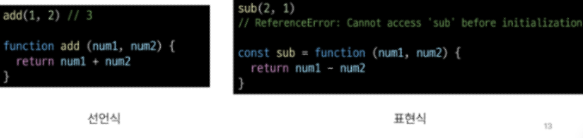

### 함수 선언식과 표현식 종합

## 매개변수

### 1. 기본 함수 매개변수(Default function parameter)
  - 값이 없거나 undefined가 전달될 경우 이름 붙은 매개변수를 기본값으로 초기화 
  

### 2. 나머지 매개변수(Rest parameters)
  - 임의의 수의 인자를 **'배열'**로 허용하여 가변 인자를 나타내는 방법
  - 작성 규칙
    - 함수 정의 시 나머지 매개변수 하나만 작성할 수 있음
    - 나머지 매개변수는 함수 정의에서 매개변수 마지막에 '...~'의 형태로 위치해야 함 
    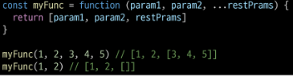
  
### 매개변수와 인자의 개수 불일치
  - 매개변수 개수 > 인자 개수
  - 누락된 인자는 undefined로 할당 
  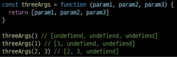
  - 매개변수 개수 < 인자 개수
  - 초과 입력한 인자는 사용하지 않음 
  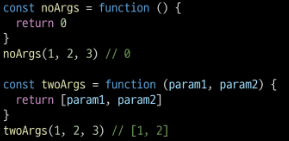

## Spread syntax

### '...'(Spread syntax)
  - 전개 구문

### 전개 구문
  - 배열이나 문자열과 같이 반복 가능한 항목을 펼치는 것 (확장, 전개)
  - 전개 대상에 따라 역할이 다름
    - **배열이나 객체의 요소를 개별적인 값으로 분리**하거나 **다른 배열이나 객체의 요소를 현재 배열이나 객체에 추가**하는 등
  1. 함수와의 사용
      1. 함수 호출 시 인자 확장
      2. 나머지 매개변수 (압축)
  2. [객체와의 사용](#5-object-with-전개-구문)
  3. [배열과의 활용](#1-array-with-전개-구문)

### 전개 구문 활용
  - 함수와의 사용
    1. 함수 호출 시 인자 확장 
    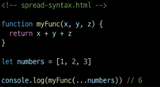
    2. 나머지 매개변수 (압축) 
    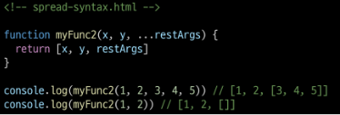

## 화살표 함수

### 화살표 함수 표현식(Arrow function expressions)
  - 함수 표현식의 간결한 표현법

### 화살표 함수 작성 결과
  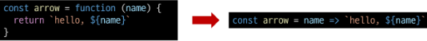

### 화살표 함수 작성 과정
  1. function 키워드 제거 후 **매개변수와 중괄호 사이**에 화살표(=>) 작성
  2. 함수의 **매개변수가 하나** 뿐이라면, 매개변수의 '()' 제거 가능(단, 생략하지 않는 것을 권장)
  3. 함수 본문의 **표현식이 한 줄**이라면, '{}'와 'return'제거 가능 
  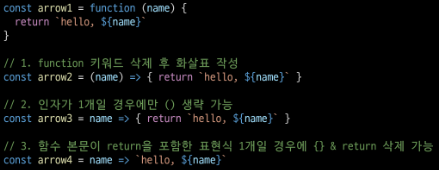

## 참고

### 화살표 함수 심화
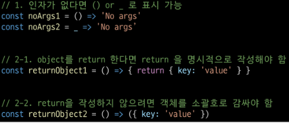

 
 

# 2. 객체

## 개요

### Object
  - 키로 구분된 데이터 집합을 저장하는 자료형(data collection) (파이썬 딕셔너리 유사)

## 구조 및 속성

### 객체 구조
  - 중괄호를 이용해 작성
  - 중괄호 안에는 key:value 쌍으로 구성된 속성(property)를 여러 개 작성 가능
  - key는 문자형만 허용(''으로 감싸져야함 단, 한 단어일 경우 생략 가능)
  - value는 모든 자료형 허용 
  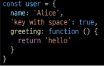

### 속성 참조
  - 점('.', chaining operator) 또는 대괄호([])로 객체 요소 접근
  - key 이름에 띄어쓰기 같은 구분자가 있으면 대괄호 접근만 가능 
  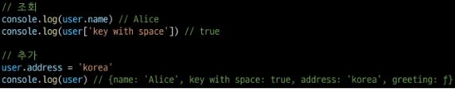 
  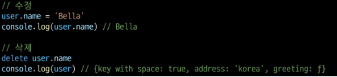
  
### 'in' 연산자
  - 속성이 객체에 존재하는지 여부를 확인 
  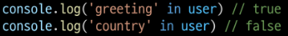

## 객체와 함수

### Method
  - 객체 속성에 정의된 함수

### Method 사용 예시
  - object.method() 방식으로 호출
  - 메서드는 객체를 '행동'할 수 있게 함 
  

## this

### Method
  - 객체 속성에 정의된 함수
    - **'this'**키워드를 사용해 객체에 대한 특정한 작업을 수행 할 수 있음

### 'this' keyword
  - 함수나 메서드를 호출한 객체를 가리키는 키워드
    - 함수 내에서 객체의 속성 및 메서드에 접근하기 위해 사용

### Method & this 사용 예시

### JavaScript에서 this는 함수를 "호출하는 방법"에 따라 가리키는 대상이 다름
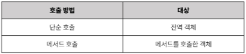

### 1. 단순 호출 시 this
  - 가리키는 대상 => 전역 객체 
  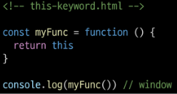

### 2. 메서드 호출 시 this
  - 가리키는 대상 => 메서드를 호출한 객체 
  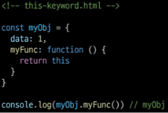

### 3. 중첩된 함수에서의 this 문제점과 해결책
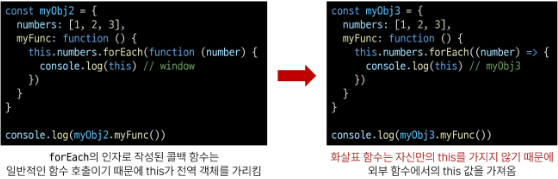

### JavaScript 'this' 정리
  - JavaScript에서 this는 함수가 "호출되는 방식"에 따라 결정되는 현재 객체를 나타냄
  - JavaScript의 함수는 호출될 때 this를 암묵적으로 전달 받음
  - Python의 self와 Java의 this가 선언 시 값이 이미 정해지는 것에 비해 JavaScript의 this는 **함수가 호출되기 전까지 값이 할당되지 않고 호출 시에 결정**됨 (동적 할당)

## 추가 객체 문법

### 1. 단축 속성
  - 키 이름과 값으로 쓰이는 변수의 이름이 같은 경우 단축 구문을 사용할 수 있음 
  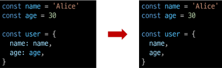

### 2. 단축 메서드
  - 메서드 선언 시 function 키워드 생략 가능 
  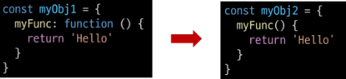

### 3. 계산된 속성 (computed property name)
  - 키가 대괄호([])로 둘러싸여 있는 속성
    - 고정된 값이 아닌 변수 값을 사용할 수 있음 
    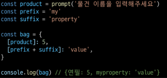

### 4. 구조 분해 할당 (destructing assignment)
  - 배열 또는 객체를 분해하여 속성을 변수에 쉽게 할당할 수 있는 문법 
    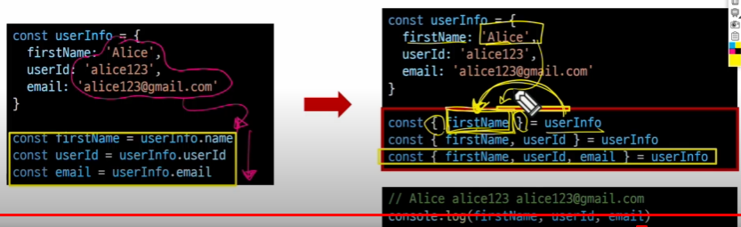
  - 활용
    - '함수의 매개변수'로 객체 구조 분해 할당 활용 가능 
    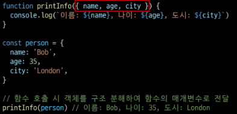

### 5. Object with '전개 구문'
  - "객체 복사"
    - 객체 내부에서 객체 전개
  - 얕은 복사에 활용 가능 
  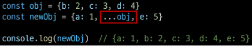

### 6. 유용한 객체 메서드
  - Object.keys()
  - Object.values() 
  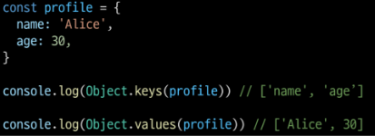

### 7. Optional chaining('?.')
  - 속성이 없는 중첩 객체를 에러 없이 접근할 수 있음
  - 만약 참조 대상이 null 또는 undefined라면 에러가 발생하는 것 대신 평가를 멈추고 undefined를 반환 
  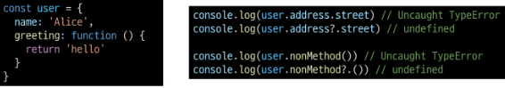
  - Optinal chaining이 없다면 다음과 같이 '&&' 연산자를 사용해야 함 
  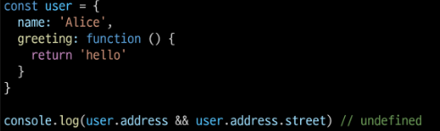

### 7. Optional chaining 장점
  - 참조가 누락될 가능성이 있는 경우 연결된 속성으로 접근할 때 더 짧고 간단한 표현식을 작성할 수 있음
  - 어떤 속성이 필요한지에 대한 보증이 확실하지 않는 경우에 객체의 내용을 보다 편리하게 탐색할 수 있음

### 7. Optional chaining 주의사항
  1. Optional chaining은 존재하지 않아도 괜찮은 대상에만 사용해야 함 (남용 X)
      - 왼쪽 평가대상이 없어도 괜찮은 경우에만 선택적으로 사용 
      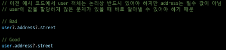
  2. Optional chaining 앞의 변수는 반드시 선언되어 있어야 함 
    

### 7. Optional chaining 요약
  1. obj?.prop
      - obj가 존재하면 obj.prop을 반환하고, 그렇지 않으면 undefined를 반환
  2. obj?.[prop]
      - obj가 존재하면 obj[prop]을 반환하고, 그렇지 않으면 undefined를 반환
  3. obj?.method()
      - obj가 존재하면 obj.method()를 호출하고, 그렇지 않으면 undefined를 반환

## JSON
  - "JavaScript Object Notation"
  - Key-Value 형태로 이루어진 자료 표기법
  - JavaScript의 Object와 유사한 구조를 가지고 있지만 JSON은 형식이 있는 "문자열"
  - JavaScript에서 JSON을 사용하기 위해서는 Object 자료형으로 변경해야 함

### Object <-> JSON 변환하기
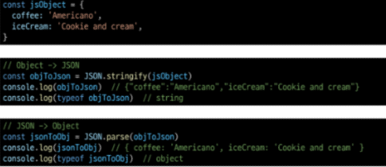

## 참고

### new 연산자
  - JS에서 객체를 하나 생성한다고 한다면?
    - 하나의 객체를 선언하여 생성
  - 동일한 형태의 객체를 또 만든다면?
    - 또 다른 객체를 선언하여 생성해야 함 
    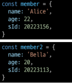
  - **불편하다**
  - 사용자 정의 객체 타입을 생성
  - 매개변수
      1. constructor : 객체 인스턴스의 타입을 기술(명세)하는 함수
      2. arguments : constructor와 함께 호출될 값 목록 
      
  - 활용 
  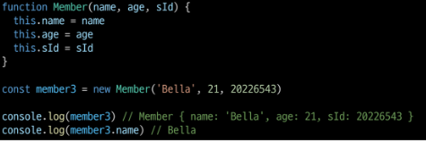

### JavaScript 'this'장단점
  - this가 미리 정해지지 않고 호출 방식에 의해 결정되는 것은
  - 장점
    - 함수(메서드)를 하나만 만들어 여러 객체에서 재사용할 수 있다는 것
  - 단점
    - 이런 유연함이 실수로 이어질 수 있다는 것
  - 개발자는 this의 동작 방식을 충분히 이해하고 장점을 취하면서 실수를 피하는 데에 집중

 
 

# 3. 배열

## 개요

### Object
  - 키로 구분된 데이터 집합(data collection)을 저장하는 자료형
  - 이제는 **순서가 있는 collection**이 필요

### Array
  - 순서가 있는 데이터 집합을 저장하는 자료구조

### 배열 구조
  - 대괄호([])를 이용해 작성
  - 배열 요소 자료형 : 제약 없음
  - length 속성을 사용해 배열에 담긴 요소가 몇 개인지 알 수 있음 
  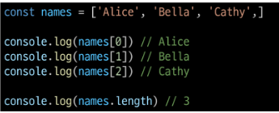

## 배열과 메서드

### 주요 메서드
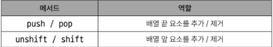

### pop()
  - 배열 끝 요소를 제거하고, 제거한 요소를 반환 
  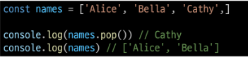

### push()
  - 배열 끝에 요소를 추가 
  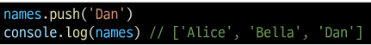

### shift()
  - 배열 앞 요소를 제거하고, 제거한 요소를 반환 
  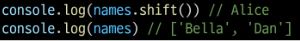

### unshift()
  - 배열 앞에 요소를 추가
  

## Array helper method

### Array Helper Methods
  - 배열을 **순회**하며 **특정 로직을 수행**하는 메서드
    - 메서드 호출 시 인자로 함수를 받는 것이 특징

### 주요 Array Helper Methods
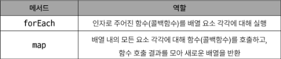

### forEach()
  - 인자로 주어진 함수를 배열 요소 각각에 대해 실행

### forEach 구조
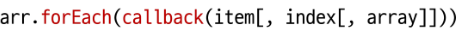
  - 콜백함수는 3가지 매개변수로 구성
      1. item: 처리할 배열의 요소
      2. index: 처리할 배열 요소의 인덱스 (선택 인자)
      3. array: forEach를 호출한 배열 (선택 인자)
  - 반환 값: undefined

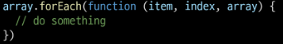
  - 콜백함수는 3가지 매개변수로 구성
      1. item: 처리할 배열의 요소
      2. index: 처리할 배열 요소의 인덱스
      3. array: forEach를 호출한 배열
  - 반환 값: undefined

### forEach 활용
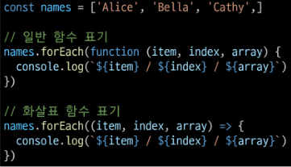
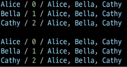

### 콜백 함수(Callback function)
  - 다른 함수에 인자로 전달되는 함수
    - 외부 함수내에서 호출되어 일종의 루틴이나 특정 작업을 진행

### 콜백 함수 예시
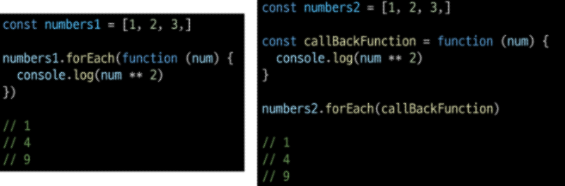

### map()
  - 배열 내의 모든 요소 각각에 대해 함수를 호출하고, 함수 호출 결과를 모아 **새로운 배열을 반환**

### map 구조
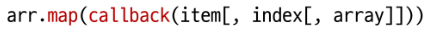
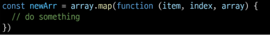
  1. itemp: 처리할 배열의 요소
  2. index: 처리할 배열 요소의 인덱스 (선택 인자)
  3. array: map을 호출한 배열 (선택 인자)
  - 반환 값: 배열의 각 요소에 대해 실행한 "callback"의 결과를 모은 새로운 배열"
      - 기본적으로 forEach 동작 원리와 같지만 forEach와 달리 새로운 배열을 반환함

### map 활용
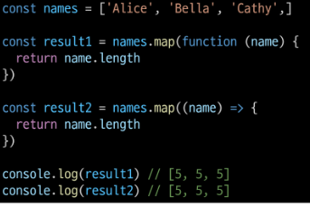

### python에서의 map 함수와 비교
  - python의 map에 square 함수를 인자로 넘겨 numbers 배열의 각 요소를 square 함수의 인자로 사용하였음 
  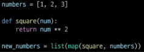
  - map 메서드에 callBackFunc 함수를 인자로 넘겨 numbers 배열의 각 요소를 callBackFunc 함수의 인자로 사용하였음 
  

### 배열 순회 종합

## 추가 배열 문법

### 1. Array with '전개 구문'
  - "배열 복사" 
  

### 2. 기타 Array Helper Methods
  - MDN 문서를 참고해 사용해보기 
  

## 참고

### 콜백함수 구조를 사용하는 이유
  1. "함수의 재사용성 측면"
      - 함수를 호출하는 코드에서 콜백 함수의 동작을 자유롭게 변경할 수 있음
      - 예를 들어, map 함수는 콜백 함수를 인자로 받아 배열의 각 요소를 순회하며 콜백 함수를 실행
      - 이때, 콜백 함수는 각 요소를 변환하는 로직을 담당하므로, map 함수를 호출하는 코드는 간결하고 가독성이 높아짐
  2. "비동기적 처리 측면"
      - setTimeout 함수는 콜백 함수를 인자로 받아 일정 시간이 지난 후에 실행됨
      - 이때, setTimeout 함수는 비동기적으로 콜백 함수를 실행하므로, 다른 코드의 실행을 방해하지 않음 
      

