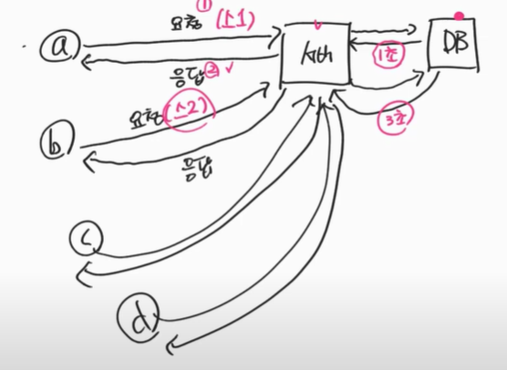
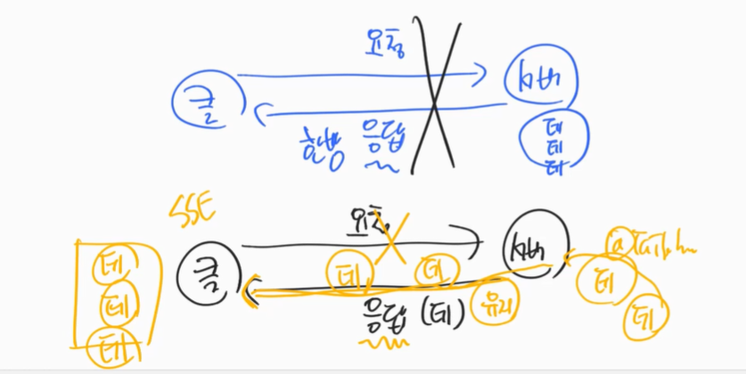

# RDBMS

- 공유, 중복x
- 데이터를 정제 후 연결하여 사용

## 장점
- 중복이 안됨(데이터 변경이 용이함)

# MongoDB(NoSQL)

- 컬렉션(List)
  - 중복을 허용
  - user: [
    {id: 1, username: "ssar", phone: 0102222},
    {id: 2, username: "cos", phone: 0103333}
    ]
  - board: [
    {id: 1, title: "제목1", content: "내용1", username: "ssar", phone: 0102222},
    ]
  => username을 변경시 user테이블과 board테이블의 username을 모두 변경해줘야 한다.

## 장점
- 데이터를 찾을 때 퍼포먼스가 좋다.

## 단점
- 데이터를 저장할 때 손이 많이 간다.
- 데이터의 일관성을 유지하기가 힘들다.

---

# 스프링 5.0
- Netty 서버(비동기 서버)
- MongoDB 연결

## 서블릿 기반 스프링
- 스레드 만들어진다(사용자 request할 때마다)
  - 독립적인 요청이 된다.

## 스프링 4.0까지의 문제점
- 모든 요청을 동시에 처리
- 컨텍스트(문맥) 스위칭이 많이 일어난다 => Time Slicing이 많이 일어난다.
  - 서버가 느려진다.

## 비동기 서버
- 각 클라이언트의 요청을 우선순위를 두고 처리 => 컨텍스트 스위칭이 일어나지 않음
- 비동기 DB가 필요 => 서버의 요청을 비동기적으로 수행하기 위해서 비동기 처리가 필요
  - R2DBC를 이용하는 방법 or 비동기DB(Mongo DB)를 활용

# SSE(Server-Sent Events)

- 서버에서 클라이언트로 단방향 실시간 이벤트 전송 웹기술
  - 실시간 알림, 실시간 주가 업데이트 등에 사용됨

- 단방향 통신 => 서버에서 클라이언트로만 데이터를 전송 가능
  - 클라이언트는 http 프로토콜을 통해 sse연결을 설정하고, 서버는 http 응답을 유지한 상태에서 데이터를 전송

- 재연결 기능을 제공하기 때문에 연결이 끊어졌을 때 자동으로 다시 연결
  - 기존의 폴링 방식과 비교하였을 때 효율적
  - 서버와 클라이언트 간의 불필요한 통신을 최소화