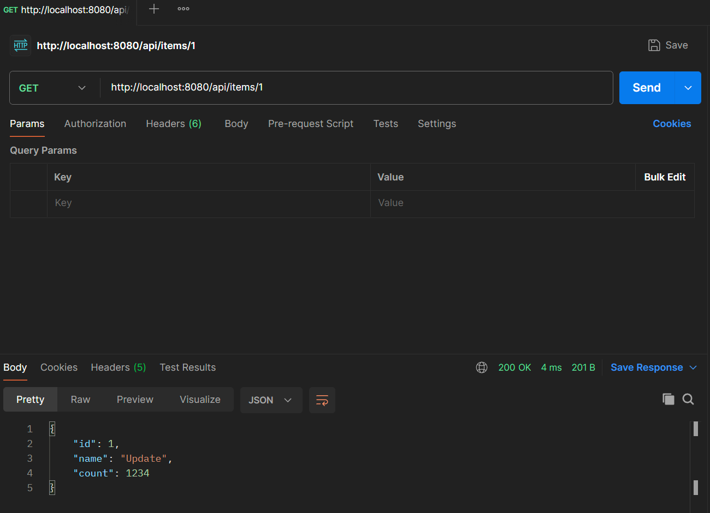

# Sub PJT

## Spring Boot
- 스프링부트 프로젝트 생성 및 기본 CRUD 및 Rest Api 생성 방법 학습

## 프로젝트 환경
- JDK17
- Spring Boot 3.2.3

## 학습내용

### 계층
1. Controller
    - HTTP요청(GET, POST..층) 처리 및 응답을 반환
      ```Java
      @GetMapping("/")
      public String findAll(Model model) {
          // Service를 호출하여 필요한 데이터를 반환
          List<BoardDTO> boardDTOList =  boardService.findAll();
          model.addAttribute("boardList", boardDTOList);
          return "list";
      }
      ```
2. Service
    - Controller로부터 받은 요청을 처리하기 위해 데이터베이스 또는 외부 리소스와 상호 작용하는 역할
      ```Java
      public List<BoardDTO> findAll() {
        List<BoardEntity> boardEntityList = boardRepository.findAll();
        List<BoardDTO> boardDTOList = new ArrayList<>();
        for (BoardEntity boardEntity: boardEntityList) {
            boardDTOList.add(BoardDTO.toBoardDTO(boardEntity));
        }
        return boardDTOList;
      }
      ```
3. Repository
    - 데이터베이스와 직접 상호 작용하는 로직을 캡슐화하며, 데이터베이스에 데이터 저장, 조회, 업데이트, 삭제하는 작업을 처리
    - JPA, Hibernate...를 통해 자동으로 구현체 생성
      ```Java
      public interface BoardRepository extends JpaRepository<BoardEntity, Long> {
      // update board_table set board_hits=board_hits+1 where id=?
        @Modifying
        @Query(value = "update BoardEntity b set b.boardHits=b.boardHits+1 where b.id=:id")
        void updateHits(@Param("id") Long id);
      }
      ```

### REST Api
1. REST
    - Representation State Transfer의 약어로 분산 하이퍼미디어 시스템을 위한 소프트웨어 아키텍처의 한 형식
    - 네트워크 상에서 Client와 Server사이의 통신 방식 중 하나이며, 웹의 기존 기술과 HTTP 프로토콜을 그대로 활용할 수 있는 아키텍처
    - 자원을 이름(자원의 표현)으로 구분하여 해당 자원의 상태(정보)를 주고 받는 모든 것을 의미

2. @RestController
    - @Controller와 @ResponseBody 어노테이션을 활용하여 데이터를 반환하는 과정을 합친 형태
    - JSON 형태의 객체 데이터를 반환
    - 단, Client가 예상하는 HttpStatus를 설정할 수 없기 때문에 객체 상황에 맞는 ResponseEntity로 감싸서 반환해줘야 함

    - 예시
      ```Java
      @RestController
      @RequiredArgsConstructor
      @RequestMapping("/api")
      public class ItemController {
          private final ItemService itemService;

          @PostMapping("/items")
          public void save(@RequestBody ItemDto itemDto) {
              itemService.saveItem(itemDto);
          }
      }
      ```
      

3. 산출물
    1. Create
      
    2. Read
      
    3. Update
      
      
    3. Delete
      
    