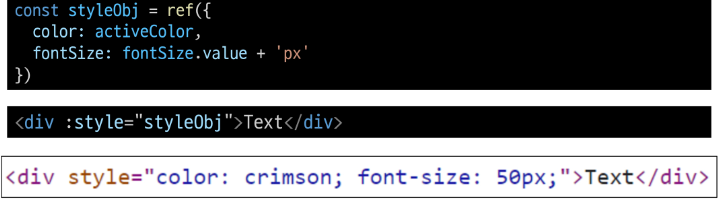
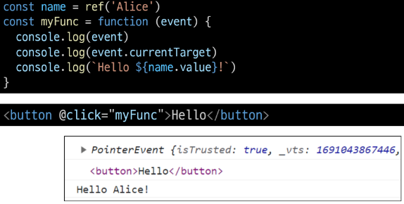

# Basic Syntax - 01

# INDEX
1. [Template Syntax](#1-template-syntax)
   1. [개요](#개요)
   2. [Directive](#directive)
2. [Dynamically data binding](#2-dynamically-data-binding)
   1. [Attribute Bindings](#attribute-bindings)
   2. [Class and Style Bindings](#class-and-style-bindings)
3. [Event Handling](#3-event-handling)
4. [Form Input Bindings](#4-form-input-bindings)
   1. [v-model 활용](#v-model-활용)
5. [참고](#참고)

<br>
<br>

# 1. Template Syntax

## 개요

### Template Syntax
- DOM을 기본 구성 요소 인스턴스의 데이터에 선언적으로 바인딩(Vue Instance와 DOM을 연결)할 수 있는 HTML 기반 템플릿(확장된 문법 제공) 구문을 사용

### Template Syntax 종류
1. [Text Interpolation](#1-text-interpolation)
2. [Raw HTML](#2-raw-html)
3. [Attribute Bindings](#3-attribute-bindings)
4. [JavaScript Expressions](#4-javascript-expressions)

### 1. Text Interpolation

- 데이터 바인딩의 가장 기본적인 형태
- 이중 중괄호 구문 (콧수염 구문)을 사용
- 콧수염 구문은 해당 구성 요소 인스턴스의 msg 속성 값으로 대체
- msg 속성이 변경될 때마다 업데이트 됨

### 2. Raw HTML


- 콧수염 구문은 데이터를 일반 텍스트로 해석하기 때문에 실제 HTML을 출력하려면 v-html을 사용해야 함

### 3. Attribute Bindings


- 콧수염 구문은 HTML 속성 내에서 사용할 수 없기 때문에 v-bind를 사용
- HTML의 id 속성 값을 vue의 dynamicId 속성과 동기화 되도록 함
- 바인딩 값이 null이나 undefind인 경우 렌더링 요소에서 제거됨

### 4. JavaScript Expressions


- Vue는 모든 데이터 바인딩 내에서 JavaScript 표현식의 모든 기능을 지원
- Vue 템플릿에서 JavaScript 표현식을 사용할 수 있는 위치
  1. 콧수염 구문 내부
  2. 모든 directive의 속성 값 (v-로 시작하는 특수 속성)

### Expressions 주의사항
- 각 바인딩에는 하나의 단일 표현식만 포함될 수 있음
  - 표현식은 값으로 평가할 수 있는 코드 조각 (return 뒤에 사용할 수 있는 코드여야 함)
- 작동하지 않는 경우
  
  

## Directive
- 'v-' 접두사가 있는 속성

### Directive 특징
- Directive의 속성 값은 단일 JavaScript 표현식이어야 함 (v-for, v-on 제외)
- 표현식 값이 변경될 때 DOM에 반응적으로 업데이트를 적용
- 예시
  - v-if는 seen 표현식 값의 T/F를 기반으로 <p> 요소를 제거/삽입

  

### Directive 전체 구문


### Directive - Arguments
- 일부 directive는 directive 뒤에 콜론(:)으로 표시되는 인자를 사용할 수 있음
- 아래 예시의 href는 HTML a 요소의 href 속성 값을 myUrl 값에 바인딩 하도록 하는 v-bind의 인자
  
  

- 아래 예시의 click은 이벤트 수신할 이벤트 이름을 작성하는 v-on의 인자
  
  

### Directive - Modifiers
- . (dot)로 표시되는 특수 접미사로, directive가 특별한 방식으로 바인딩되어야 함을 나타냄
- 예를 들어 .prevent는 발생한 이벤트에서 event.preventDefault()를 호출하도록 v-on에 지시하는 modifier

  

### Built-in Directives
- v-text
- v-show
- v-if
- v-for
- ...
- https://vuejs.org/api/built-in-directives.html

<br>
<br>

# 2. Dynamically data binding

### v-bind
- 하나 이상의 속성 또는 컴포넌트 데이터를 표현식에 동적으로 바인딩
- 사용처
  1. [Attribute Bindings](#attribute-bindings)
  2. [Class and Style Bindings]()

## Attribute Bindings
- HTML의 속성 값을 Vue의 상태 속성 값과 동기화 되도록 함
  ```html
  <!-- v-bind.html -->
  
  <a v-bind:href="myUrl">Link</a>
  ```
- v-bind shorthand(약어)
  - '**:**'(colon)
  ```html
  
  <a :href="myUrl">Link</a>
  ```
- Dynamic attribute name (동적 인자 이름)
  - 대괄호로 감싸서 directive argument에 JavaScript 표현식을 사용할 수도 있음
  - JavaScript 표현식에 따라 동적으로 평가된 값이 최종 argument 값으로 사용됨
  
  

  - **대괄호 안에 작성하는 이름은 반드시 소문자로만 구성 가능 -> 카멜케이스 불가능(브라우저가 속성 이름을 소문자로 강제 변환)**

  ```html
  
  <a :href="myUrl">Link</a>
  <p :[dynamicattr]="dynamicValue">................</p>
  ```
  ```html
  <script>
  const { createApp, ref } = Vue

  const app = createApp({
    setup() {
      const imageSrc = ref('https://picsum.photos/200/')
      const myUrl = ref('https://www.google.co.kr/')
      const dynamicattr = ref('title')
      const dynamicValue = ref('Hello')
      return {
        imageSrc,
        myUrl,
        dynamicattr,
        dynamicValue
      }
    }
  })

  app.mount('#app')
  </script>
  ```

  

## Class and Style Bindings
- 클래스와 스타일은 모두 속성이므로 v-bind를 사용하여 다른 속성과 마찬가지로 동적으로 문자열 값을 할당할 수 있음
- 그러나 단순히 문자열 연결을 사용하여 이러한 값을 생성하는 것은 번거롭고 오류가 발생하기가 쉬움
- Vue는 클래스 및 스타일과 함께 v-bind를 사용할 때 객체 또는 배열을 활용한 개선 사항을 제공

### Class and Style Bindings가 가능한 경우
1. Binding HTML Classes
   1. [Binding to Objects](#11-binding-html-classes---binding-to-objects)
   2. [Binding to Arrays](#12-bingding-html-classes---binding-to-arrays)
2. Binding Inline Styles
   1. [Binding to Objects](#21-binding-inline-styles---binding-to-objects)
   2. [Binding to Arrays](#22-binding-inline-styles---binding-to-arrays)

### 1.1 Binding HTML Classes - Binding to Objects
- 객체를 :class에 전달하여 클래스를 동적으로 전환할 수 있음
- 예시 1
  - isActive의 T/F에 의해 active 클래스의 존재가 결정됨

  

- 객체에 더 많은 필드를 포함하여 여러 클래스를 전환할 수 있음
- 예시 2
  - :class directive를 일반 클래스 속성과 함께 사용 가능

  

- 반드시 inline 방식으로 작성하지 않아도 됨
  
  

### 1.2 Bingding HTML Classes - Binding to Arrays
- :class를 배열에 바인딩하여 클래스 목록을 적용할 수 있음
- 예시1
  
  

- 배열 구문 내에서 객체 구문 사용
- 예시2

  

### 2.1 Binding Inline Styles - Binding to Objects
- :style은 JavaScript 객체 값에 대한 바인딩을 지원(HTML style 속성에 해당)
- 예시 1

  

- 실제 CSS에서 사용하는 것처럼 :style은 kebab-cased 키 문자열도 지원 (단, camelCase 작성을 권장)
- 예시 2

  

- 템플릿을 더 깔끔하게 작성하려면 스타일 객체에 직접 바인딩하는 것을 권장
- 예시 3

  

### 2.2 Binding Inline Styles - Binding to Arrays
- 여러 스타일 객체의 배열에 :style을 바인딩할 수 있음
- 작성한 객체는 병합되어 동일한 요소에 적용
- 예시

  

### v-bind 종합
- https://vuejs.org/api/built-in-directives.html#v-bind

<br>
<br>

# 3. Event Handling

### v-on
- DOM 요소에 이벤트 리스너를 연결 및 수신

### v-on 구성
```html
v-on:event="handler"
```
- handler 종류
  1. [Inline handlers](#1-inline-handlers): 이벤트가 트리거 될 때 실행 될 JavaScript 코드
  2. [Method handlers](#2-method-handlers): 컴포넌트에 정의된 메서드 이름
- v-on shorthand(약어)
  ```html
  @event="handler"
  ```

### 1. Inline handlers
- Inline handlers는 주로 간단한 상황에 사용
```html
<!-- event-handling.html -->

const count = ref(0)
```
```html
<button @click="count++">Add 1</button>
<p>Count: {{ count }}</p>
```

### 2. Method Handlers
- Inline handlers로는 불가능한 대부분의 상황에서 사용

  

- Method Handlers는 이를 트리거하는 기본 DOM Event 객체를 자동으로 수신

  

### Inline Handlers에서의 메서드 호출
- 메서드 이름에 직접 바인딩하는 대신 Inline handlers에서 메서드를 호출할 수 도 있음
- 이렇게 하면 기본 이벤트 대신 사용자 지정 인자를 전달할 수 있음

  

### Inline Handlers에서의 event인자에 접근하기
- Inline Handlers에서 원래 DOM 이벤트에 접근하기
- $event 변수를 사용하여 메서드에 전달

  

### Event Modifiers
- Vue는 v-on에 대한 Event Modifiers를 제공해 event.preventDefault()와 같은 구문을 메서드에서 작성하지 않도록 함
- stop, prevent, self 등 다양한 modifiers를 제공
  - 메서드 DOM 이벤트에 대한 처리보다는 데이터에 관한 논리를 작성하는 것에 집중할 것
```html
<form @submit.prevent="onSubmit">...</form>
<a @click.stop.prevent="onLink">...</a>
```
- **Modifiers는 chained 되게끔 작성할 수 있으며 이때는 작성된 순서로 실행되기 때문에 작성 순서에 유의**

### Key Modifiers
- Vue는 키보드 이벤트를 수신할 때 특정 키에 관한 별도 modifiers를 사용할 수 있음
- 예시
  - key Enter일 대만 onSubmit 이벤트를 호출하기
    ```html
    <input @keyup.enter="onSubmit">
    ```

### v-on 종합
- https://vuejs.org/api/built-in-directives.html#v-on

<br>
<br>

# 4. Form Input Bindings
- form을 처리할 때 사용자가 input에 입력하는 값을 실시간으로 JavaScript 상태에 동기화해야 하는 경우 (**양방향 바인딩**)
- 양방향 바인딩 방법
  1. [v-bind와 v-on을 함께 사용](#1-v-bind와-v-on을-함께-사용)
  2. [v-model 사용](#2-v-model-사용)

### 1. v-bind와 v-on을 함께 사용
- v-bind를 사용하여 input 요소의 value 속성 값을 입력 값으로 사용
- v-on을 사용하여 input 이벤트가 발생 할 때마다 input 요소의 value 값을 별도 반응형 변수에 저장하는 핸들러를 호출

  

- v-bind를 사용하여 input 요소의 value 속성 값을 입력 값으로 사용
- v-on을 사용하여 input 이벤트가 발생 할 때마다 input 요소의 value 값을 별도 반응형 변수에 저장하는 핸들러를 호출

```html
<!-- form-input-bindings.html -->

const inputText1 = ref('')
const onInput = function (event) {
  inputText1.value = event.currentTarget.value
}
```
```
<p>{{ inputText1 }}</p>
<input :value="inputtext1" @input="inInput">
```

### v-model
- form input 요소 도는 컴포넌트에서 **양방향 바인딩**을 만듦
- 텍스트 인풋을 작성할 경우 한국어가 제대로 출력되지 않음 => v-bind와 v-on을 사용하는 것을 권장

### 2. v-model 사용
- v-model을 사용하여 사용자 입력 데이터와 반응형 변수를 실시간 동기화

```html
const inputText2 = ref('')
```
```html
<p>{{ inputText2 }}</p>
<input v-model="inputText2">
```

- v-model을 사용하여 사용자 입력 데이터와 반응형 변수를 실시간 동기화
- IME가 필요한 언어(한국어, 중국어, 일본어 등)의 경우 v-model이 제대로 업데이트 되지 않음
- 해당 언어에 대해 올바르게 응답하려면 v-bind와 v-on 방법을 사용해야 함

  

## v-model 활용

### v-model과 다양한 입력(input) 양식
- v-model은 단순 text input 뿐만 아니라 Checkbox, Radio, Select등 다양한 타입의 사용자 입력 방식과 함께 사용 가능

### Checkbox 활용
1. 단일 체크박스와 boolean 값 활용

  

  - checked의 값을 false => 체크박스 해제가 기본값
  - true => 체크박스 체크가 기본값
2. 여러 체크박스와 배열 활용
   - 해당 배열에는 현재 선택된 체크박스의 값이 포함됨

    

    

### Select활용
- select에서 v-model 표현식의 초기 값이 어떤 option과도 일치하지 않는 경우 select 요소는 "선택되지 ㅇ낳은(unselected)" 상태로 렌더링 됨

  

  

### v-model 종합
- https://vuejs.org/api/built-in-directives.html#v-model

<br>
<br>

# 참고

