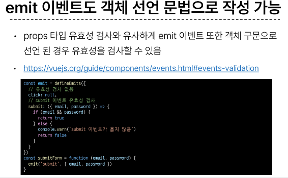

# Component State Flow

# INDEX
1. [Passing Props](#1-passing-props)
   1. [개요](#개요1)
   2. [사전 준비](#사전-준비)
   3. [Props 선언](#props-선언)
   4. [Props 세부사항](#props-세부사항)
2. [Component Events](#2-component-events)
   1. [개요](#개요2)
   2. [Event 발신 및 수신](#event-발신-및-수신)
   3. ['emit' Event 선언](#emit-event-선언)
   4. [Evnet 인자](#event-인자)
   5. [Event 세부사항](#event-세부사항)
   6. [emit Event 실습](#emit-event-실습)
3. [참고](#참고)

<br>
<br>

# 1. Passing Props

## 개요1

### 같은 데이터 하지만 다른 컴포넌트
- 동일한 사진 데이터가 한 화면에 다양한 위치에서 여러 번 출력되고 있음
- 하지만 해당 페이지를 구성하는 컴포넌트가 여러 개라면 각 컴포넌트가 개별적으로 동일한 데이터를 관리해야 할까?
- 그렇다면 사진을 변경해야 할 때 모든 컴포넌트에 대해 변경 요청을 해야 함
- "공통된 부모 컴포넌트에서 관리하자"

  


### Props
- 부모 컴포넌트로부터 자식 컴포넌트로 데이터를 전달하는데 사용되는 속성

### One-Way Data Flow
- 모든 props는 자식 속성과 부모 속성 사이에 **하향식 단방향 바인딩**을 형성(one-way-down binding)

### Props 특징
- 부모 속성이 업데이트되면 자식으로 흐르지만 그 반대는 안됨
- 즉, 자식 컴포넌트 내부에서 props를 변경하려고 시도해서는 안되며 불가능
- 또한 부모 컴포넌트가 업데이트될 때마다 자식 컴포넌트의 모든 props가 최신 값으로 업데이트 됨
- 부모 컴포넌트에서만 변경하고 이를 내려 받는 자식 컴포넌트는 자연스럽게 갱신

### 단방향인 이유
- 하위 컴포넌트가 실수로 상위 컴포넌트의 상태를 변경하여 앱에서의 데이터 흐름을 이해하기 어렵게 만드는 것을 방지하기 위함

## 사전 준비
1. vue 프로젝트 생성
2. 초기 생성된 컴포넌트 모두 삭제 (App.vue 제외)
3. src/assets 내부 파일 모두 삭제
4. main.js 해당 코드 삭제

  ```JavaScript
  // main.js

  import './assets/main.css' // 삭제
  ```

### App > Parent >ParentChild 컴포넌트 관계 작성
- App 컴포넌트 작성
```html
<!-- App.vue -->

<template>
  <div>
    <Parent />
  </div>
</template>

<script setup>
import Parent from '@/components/Parent.vue'
</script>
```

- Parent 컴포넌트 작성
```html
<!-- Parent.vue -->

<template>
  <div>
    <ParentChild />
  </div>
</template>

<script setup>
import ParentChild from '@/components/ParentChild.vue'
</script>
```

- ParentChild 컴포넌트 작성
```html
<!-- ParentChild.vue -->

<template>
  <div></div>
</template>

<script setup>
</script>
```

## Props 선언
- 부모 컴포넌트에서 보낸 props를 사용하기 위해서는 자식 컴포넌트에서 명시적인 props 선언이 필요

### Props 작성
- 부모 컴포넌트 Parent에서 자식 컴포넌트 ParentChild에 보낼 props 작성
```html
<!-- Parent.vue -->

<template>
  <div>
    <!-- html => '-'케밥 케이스 사용 -->
    <ParentChild my-msg="message" />
  </div>
</template>
```


### Props 선언 2가지 방식
1. [문자열 배열을 사용한 선언](#1-문자열-배열을-사용한-선언)
2. [객체를 사용한 선언](#2-객체를-사용한-선언)

### 1. 문자열 배열을 사용한 선언
- defineProps()를 사용하여 props를 선언
```html
<!-- ParentChild.vue -->

<script setup>
  // JS 부분은 카멜케이스 사용
  defineProps(['myMsg'])
</script>
```

### 2. 객체를 사용한 선언
- 객체 선언 문법의 각 객체 속성의 키는 props의 이름이 되며, 객체 속성의 값은 값이 될 데이터의 타입에 해당하는 생성자 함수(Number, String..)이어야 함
- **객체 선언 문법 사용 권장**
```html
<!-- ParentChild.vue -->

<script setup>
  defineProps({
    myMsg: String,
  })
</script>
```


### prop 데이터 사용
- 템플릿에서 반응형 변수와 같은 방식으로 활용
  ```html
  <!-- ParentChild.vue -->
  
  <div>
    <p>{{ myMsg }}</p>
  </div>
  ```

- props를 객체로 반환하므로 필요한 경우 JavaScript에서 접근 가능
  ```html
  <script setup>
    const props = defineProps({ myMsg: String })
    console.log(props) // {myMsg: 'message'}
    console.log(props.myMsg) // 'message'
  </script>
  ```

- prop 출력 결과 확인
  
  

### 한 단계 더 prop 내려 보내기
- ParentChild 컴포넌트를 부모로 갖는 ParentGrandChild 컴포넌트 생성 및 등록
```html
<!-- ParentGrandChild -->

<template>
  <div></div>
</template>

<script setup></script>
```
```html
<!-- ParentChild.vue -->

<template>
  <div>
    {{ myMsg }}
    <ParentGrandChild />
  </div>
</template>

<script setup>
import ParentGrandChild from '@/components/ParentGrandChild.vue'

const props = defineProps({
                myMsg: String,
              })
</script>
```

- ParentChild 컴포넌트에서 Parent로 부터 받은 prop인 myMsg를 ParentGrandChild에게 전달

  

- 출력 결과 확인
- ParentGrandChild가 받아서 출력하는 prop은 Parent에 정의 되어있는 prop이며 Parent가 prop을 변경할 경우 이를 전달받고 있는 ParentChild, ParentGrandChild에서도 모두 업데이트 됨

  

## Props 세부사항
1. [Props Name Casing(Props 이름 컨벤션)](#1-props-name-casingprops-이름-컨벤션)
2. [Static Props & Dynamic Props](#2-static-props--dynamic-props)

### 1. Props Name Casing(Props 이름 컨벤션)
- 선언 및 템플릿 참조 시 (-> camelCase)
  
  

- 자식 컴포넌트로 전달 시 (-> kebab-case)

  

### 2. Static Props & Dynamic Props
- 지금까지 작성한 것은 Static(정적) props
- v-bind를 사용하여 **동적으로 할당된 props**를 사용할 수 있음
1. Dynamic props 정의

  

2. Dynamic props 선언 및 출력

  

3. Dynamic props 출력 확인

  

<br>
<br>

# 2. Component Events

## 개요2


- 부모는 자식에게 데이터를 전달(Pass Props)하며, 자식은 자신에게 일어난 일을 부모에게 알림(Emit event) **부모가 prop 데이터를 변경하도록 소리쳐야 한다.**

### $emit()
- 자식 컴포넌트가 이벤트를 발생시켜 부모 컴포넌트로 데이터를 전달하는 역할의 메서드
- **'$'**표기는 Vue 인스턴스나 컴포넌트 내에서 제공되는 전역 속성이나 메서드를 식별하기 위한 접두어

### emit 메서드 구조


- event
  - 커스텀 이벤트 이름

- args
  - 추가 인자

## Event 발신 및 수신

### 이벤트 발신 및 수신 (Emitting and Listening to Events)
- $emit을 사용하여 템플릿 표현식에서 직접 사용자 정의 이벤트를 발신
  ```html
  <button @click="$emit('someEvent')">클릭</button>
  ```

- 그러면 부모는 v-on을 사용하여 수신할 수 있음
  ```html
  <ParentComp @some-event="someCallback" />
  ```

### 이벤트 발신 및 수신하기
- ParentChild에서 someEvent라는 이름의 사용자 정의 이벤트를 발신
  ```html
  <!-- ParentChild.vue -->

  <button @click="$emit('someEvent')">클릭</button>
  ```

- ParentChild의 부모 Parent는 v-on을 사용하여 발신된 이벤트를 수신
- 수신 후 처리할 로직 및 콜백함수 호출

  

  ```html
  <!-- Parent.vue -->

  <script>
  const someCallback = () => {
    console.log("ParentChild가 발신한 emit 이벤트를 수신했습니다.")
  }
  </script>
  ```

- 이벤트 수신 결과

  

## 'emit' Event 선언
- defineEmits()를 사용하여 명시적으로 발신할 이벤트를 선언할 수 있음
- script에서 $emit 메서드를 접근할 수 없기 때문에 defineEmits()는 $emit 대신 사용할 수 있는 동등한 함수를 반환


### 이벤트 선언하기
- 이벤트 선언 방식으로 추가 버튼 작성 및 결과 확인

```html
<!-- ParentChild.vue -->
<script>
const emit = defineEmits(['someEvent'])

const buttonClick = () => {
  emit('someEvent')
}
</script>
```
```html
<!-- ParentChild.vue -->

<button @click="buttonClick">클릭</button>
```

## Event 인자
- 이벤트 발신 시 추가 인자를 전달하여 값을 제공할 수 있음

### Event 인자 전달하기
- ParentChild에서 이벤트를 발신하여 Parent로 추가 인자 전달하기
  ```html
  <!-- ParentChild.vue -->

  <script>
    ...
    const emit = defineEmits(['someEvent', 'emitArgs'])

    const emitArgs = () => {
      emit('emitArgs', 1, 2, 3)
    }
  </script>
  ```
  ```html
  <!-- ParentChild.vue -->

  <button @click="emitArgs">추가 인자 전달</button>
  ```

- ParentChild에서 발신한 이벤트를 Parent에서 수신
  ```html
  <!-- Parent.vue -->

  <ParentChild
      @some-event="someCallback"
      @emit-args="getNumbers"
      my-msg="message"
      :dynamic-props="name"
  />
  ```html
  <!-- Parent.vue -->

  <script>
    ...
    const getNumber = (...args) => {
      console.log(args)
      console.log(`ParentChild가 전달한 추가인자 ${args}를 수신`)
    }
  ```

- 추가 인자 전달 확인

  

## Event 세부사항

### Event Name Casing


## emit Event 실습
- 최하단 컴포넌트 ParentGrandChild에서 Parent 컴포넌트의 name 변수 변경 요청하기

  

- ParentGrandChild에서 이름 변경을 요청하는 이벤트 발신

  

  ```html
  <!-- ParentGrandChild.vue -->

  <script>
    ...
    const emit = defineEmits(['updateName'])

    const updateName = () => {
      emit('updateName')
    }
  </script>
  ```
  ```html
  <!-- ParentGrandChild.vue -->

  <button @click="updateName">이름 변경</button>
  ```

- 이벤트 수신 후 이름 변경을 요청하는 이벤트 발신

  

    ```html
  <!-- ParentChild.vue -->

  <script>
    ...
    const emit = defineEmits(['updateName'])

    const updateName = () => {
      emit('updateName')
    }
  </script>
  ```
  ```html
  <!-- ParentChild.vue -->

  <ParentGrandChild @update-name="updateName" />
  ```

- 이벤트 수신 후 이름 변수 변경 메서드 호출
- 해당 변수를 prop으로 받는 모든 곳에서 자동 업데이트
  ```html
  <!-- Parent.vue -->

  <ParentChild @update-name="updateName" />
  ```
  ```html
  <!-- Parent.vue -->

  <script setup>
    ...
    const updateName = () => {
      name.value = 'Bella'
    }
  </script>
  ```

- 버튼 클릭 후 결과 확인

  

<br>
<br>

# 참고

### 정적 & 동적 props 주의사항



