# State Management

# INDEX
1. [State Management](#1-state-management)
   1. [개요](#state-management---개요)
2. [State management library (Pinia)](#2-state-management-library-pinia)
   1. [Pinia](#pinia)
   2. [Pinia 구조](#pinia-구조)
   3. [Pinia 구성 요소 활용](#pinia-구성-요소-활용)
3. [Pinia 실습](#3-pinia-실습)
   1. [개요](#pinia-실습---개요)
   2. [사전 준비](#사전-준비)
   3. [Read Todo](#read-todo)
   4. [Create Todo](#create-todo)
   5. [Delete Todo](#delete-todo)
   6. [Update Todo](#update-todo)
   7. [Computed Todo](#computed-todo)

<br>
<br>

# 1. State Management

## State Management - 개요

### State Managemnet - 상태 관리
- Vue 컴포넌트는 이미 반응형 상태를 관리하고 있음
  - 상태 === 데이터

### 컴포넌트 구조의 단순화
- 상태(State)
  - 앱 구동에 필요한 기본 데이터
- 뷰(View)
  - 상태를 선언적으로 매핑하여 시각화
- 기능(Actions)
  - 뷰에서 사용자 입력에 대해 반응적으로 상태를 변경할 수 있게 정의된 동작

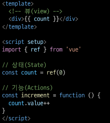

- "단방향 데이터 흐름"의 간단한 표현

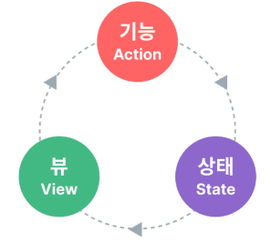

### 상태 관리의 단순성이 무너지는 시점
- "여러 컴포넌트가 상태를 공유할 때"
  1. 여러 뷰가 동일한 상태에 종속되는 경우
  2. 서로 다른 뷰의 기능이 동일한 상태를 변경시켜야 하는 경우

1. 여러 뷰가 동일한 상태에 종속되는 경우
   - 공유 상태를 공통 조상 컴포넌트로 "끌어올린" 다음 props로 전달하는 것
   - 하지만 계층 구조가 깊어질 경우 비효율적, 관리가 어려워 짐

    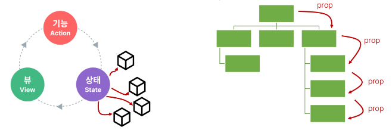

2. 서로 다른 뷰의 기능이 동일한 상태를 변경시켜야 하는 경우
   - 발신(emit)된 이벤트를 통해 상태의 여러 복사본을 변경 및 동기화 하는 것
   - 마찬가지로 관리의 패턴이 깨지기 쉽고 유지 관리할 수 없는 코드가 됨

    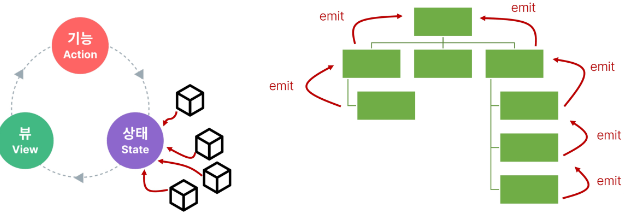

### 해결책
- 각 컴포넌트의 공유 상태를 추출하여, 전역에서 참조할 수 있는 저장소에서 관리

  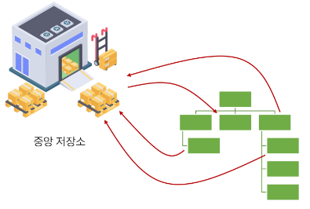

  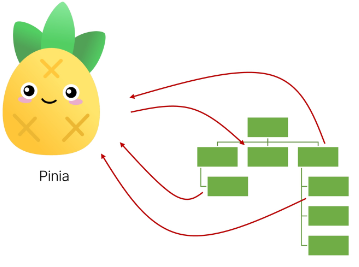

- 컴포넌트 트리는 하나의 큰 "뷰"가 되고 모든 컴포넌트는 트리 계층 구조에 관계 없이 상태에 접근하거나 기능을 사용할 수 있음
- Vue의 공식 상태 관리 라이브러리 === "Pinia"

  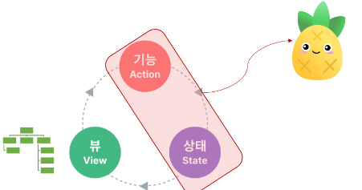

<br>
<br>

# 2. State management library (Pinia)

## Pinia
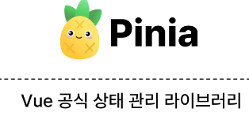

### Pinia 설치
- Vite 프로젝트 빌드 시 Pinia 라이브러리 추가

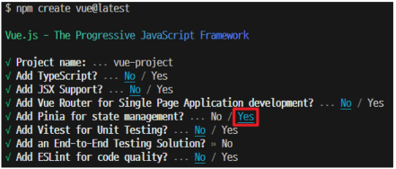

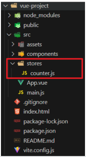

## Pinia 구조

### Pinia 구성 요소
1. store
2. state
3. getters
4. actions
5. plugin

### 1. stroe
- 중앙 저장소
- 모든 컴포넌트가 공유하는 상태, 기능 등이 작성됨

  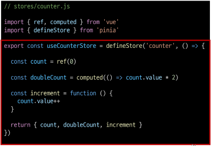

### 2. state
- 반응형 상태(데이터)
- ref() === state

  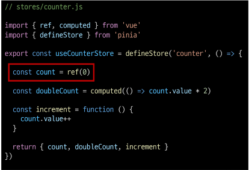

### 3. getters
- 계산된 값
- computed() === getters

  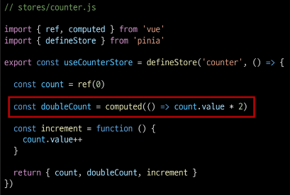

### 4. actions
- 메서드
- function() === actions

  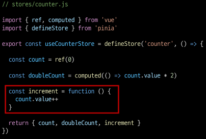

### 5. plugin
- 애플리케이션의 상태 관리에 필요한 추가 기능을 제공하거나 확장하는 도구나 모듈
- 애플리케이션의 상태 관리를 더욱 간편하고 유연하게 만들어주며 패키지 매니저로 설치 이후 별도 설정을 통해 추가 됨

### Pinia 구정 요소 종합
- Pinia는 store라는 저장소를 가짐
- store는 state, getters, actions으로 이루어지며 각각 ref(), computed(), function()과 동일함

## Pinia 구성 요소 활용

### State
- store 인스턴스로 state에 접근하여 직접 읽고 쓸 수 있음
- 만약 store에 state를 정의하지 않았다면 컴포넌트에서 새로 추가할 수 없음

```JavaScript
<!-- App.vue -->

import { useCounterStore } from '@/stores/counter';

const store = useCounterStore()

// state 탐조 및 변경
console.log(store.count)
const newNumber = store.count + 1
```
```html
<!-- App.vue -->

<template>
<div>
  <p>{{ store.count }}</p>
</div>
</template>
```

### Getters
- store의 모든 getters를 state 처럼 직접 접근 할 수 있음

```javascript
// App.vue

// getters 참조
console.log(store.doubleCount)
```
```html
<!-- App.vue -->

<template>
  <div>
    <p>{{ store.doubleCount }}</p>
  </div>
</template>
```

### Actions
- store의 모든 actions를 직접 접근 및 호출 할 수 있음
- getters와 달리 state 조작, 비동기, API 호출이나 다른 로직을 진행할 수 있음

```javascript
// App.vue

// actions 호출
store.increment()
```
```html
<!-- App.vue -->

<template>
  <div>
    <button @click="store.increment()">+++</button>
  </div>
</template>
```

### Vue devtools로 Pinia 구성 요소 확인하기

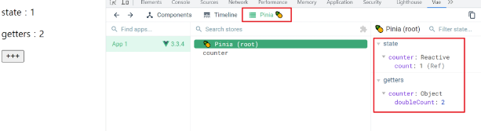

<br>
<br>

# 3. Pinia 실습

## Pinia 실습 - 개요

### Pinia를 활용한 Todo 프로젝트 구현
- Todo CRUD
- Todo 개수 계산
  - 전체 Todo
  - 완료된 Todo
  - 미완료된 Todo

### 컴포넌트 구성

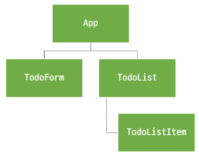

## 사전 준비
- 초기 생성된 컴포넌트 모두 삭제(App.vue 제외)
- src/assets 내부 파일 모두 삭제
- main.js 해당 코드 삭제

- TodoListItem 컴포넌트 작성
  ```html
  <!-- TodoListItem.vue -->

  <template>
    <div>
      TodoListItem
    </div>
  </template>
  ```

- TodoList 컴포넌트 작성
- TodoListItem 컴포넌트 등록
  ```vue
  <!-- TodoList.vue -->

  <template>
    <div>
      TodoListItem
    </div>
  </template>

  <script setup>
  import TodoListItem from '@/components/TodoListItem.vue'
  </script>
  ```

- TodoForm 컴포넌트 작성
  ```vue
  <!-- TodoForm.vue -->

  <template>
    <div>
      TodoForm
    </div>
  </template>
  ```

- App 컴포넌트에 TodoList, TodoForm 컴포넌트 등록
  ```vue
  <!-- App.vue -->

  <template>
    <div>
      <h1>Todo Project</h1>
      <TodoList />
      <TodoForm />
    </div>
  </template>

  <script setup>
  import TodoForm from '@/components/TodoForm.vue'
  import TodoList from '@/components/TodoList.vue'
  </script>
  ```

- 컴포넌트 구성 확인

  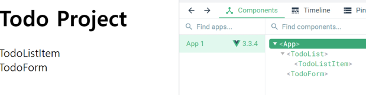

## Read Todo

### Todo 조회
- store에 임시 todos 목록 상태를 정의
  ```javascript
  // stores/counter.js

  import { ref, computed } from 'vue'
  import { defineStore } from 'pinia'

  export const useCounterStore = defineStore('counter', () => {
    let id = 0
    const todos = ref([
      { id: id++, text: 'todo 1', isDone: false },
      { id: id++, text: 'todo 2', isDone: false },
    ])

    return { todos }
  })
  ```

- store의 todos 상태를 참조
- 하위 컴포넌트인 TodoListItem을 반복 하면서 개별 todo를 props로 전달

  ```vue
  <!-- TodoList.vue -->

  <template>
    <div>
      <TodoListItem 
        v-for="todo in store.todos"
        :key="todo.id"
        :todo="todo"
      />
    </div>
  </template>

  <script setup>
  import TodoListItem from '@/components/TodoListItem.vue'
  import { useCounterStore } from '@/stores/counter'

  const store = useCounterStore()
  </script>

  <style scoped>
  </style>
  ```

- props 정의 후 데이터 출력 확인
  ```vue
  <!-- TodoListItem.vue -->

  <template>
    <div>
      {{ todoData.text }}
    </div>
  </template>

  <script setup>
  defineProps({
    todoData: Object
  })
  </script>

  <style scoped>

  </style>
  ```

  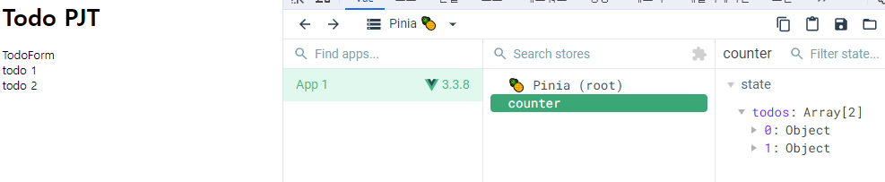

## Create Todo

### Todo 생성
- todos 목록에 todo를 생성 및 추가하는 addTodo 액션 정의
  ```javascript
  // stores/counter.js

  const addTodo = function () {
    todos.value.push({
      id: id++,
      text: todoText,
      isDone: false
    })
  }
  return { todos, addTodo }
  ```

- TodoForm에서 실시간으로 입력되는 사용자 데이터를 양방향 바인딩하여 반응형 변수로 할당
  ```vue
  <!-- TodoForm.vue -->

  <template>
    <div>
      <form>
        <input type="text" v-model="todoText">
        <input type="submit">
      </form>
    </div>
  </template>

  <script setup>
  import { ref } from 'vue';

  const todoText = ref('')
  </script>

  <style scoped>

  </style>
  ```

- submit 이벤트가 발생 했을 때 사용자 입력 텍스트를 인자로 전달하여 store에 정의한 addTodo 액션 메서드를 호출
  ```vue
  <!-- TodoForm.vue -->

  <template>
    <div>
      <form @submit.prevent="createTodo()">
        <input type="text" v-model="todoText">
        <input type="submit">
      </form>
    </div>
  </template>

  <script setup>
  import { useCounterStore } from '@/stores/counter'
  import { ref } from 'vue'

  const todoText = ref('')
  const store = useCounterStore()

  const createTodo = function () {
    store.addTodo(todoText.value)
    todoText.value = ''
  }
  </script>

  <style scoped>

  </style>
  ```

- form 요소를 선택하여 todo 입력 후 input 데이터를 초기화 할 수 있도록 처리

  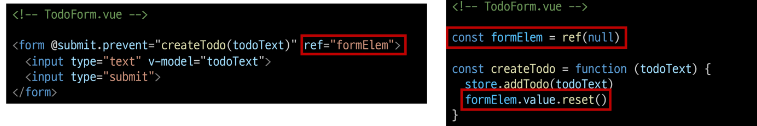

- 결과 확인

  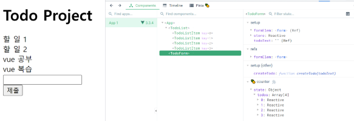

## Delete Todo

### Todo 삭제
- todos 목록에서 특정 todo를 삭제하는 deleteTodo 액션 정의
  ```javascript
  // stores/counter.js

  const deleteTodo = function () {
    console.log('delete')
  }

  return { todos, addTodo, deleteTodo }
  ```

- 각 todo에 삭제 버튼을 작성
- 버튼을 클릭하면 선택된 todo의 id를 인자로 전달해 deleteTodo 메서드 호출
  ```vue
  <!-- TodoListItem.vue -->

  <template>
    <div>
      <span>{{ todoData.text }}</span>
      <button @click="store.deleteTodo(todoData.id)">Delete</button>
    </div>
  </template>

  <script setup>
  import { useCounterStore } from '@/stores/counter'

  const store = useCounterStore()
  defineProps({
    todoData: Object
  })
  </script>

  <style scoped>

  </style>
  ```

- 전달받은 todo의 id 값을 활용해 선택된 todo의 인덱스를 구함
- 특정 인덱스 todo를 삭제 후 todos 배열을 재설정
  ```javascript
  // stores/counter.js

  const deleteTodo = function (todoId) {
    // todos 배열에서 몇번째 인덱스가 삭제되었는지 검색
    const index = todos.value.findIndex((todo) => todo.id === todoId)
    // 찾은 인덱스 값을 통해 배열에서 요소를 제거 후 원본 배열 업데이트
    todos.value.splice(index, 1)
  }

  return { todos, addTodo, deleteTodo }
  ```

- 결과 확인
  
  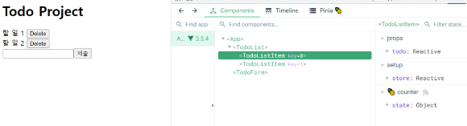

## Update Todo

### Todo 수정
- 각 todo 상태의 isDone 속성을 변경하여 todo의 완료 유무 처리하기
- 완료된 todo에는 취소선 스타일 적용하기
- todos 목록에서 특정 todo의 isDone 속성을 변경하는 updateTodo 액션 정의
- todo 내용을 클릭하면 선택된 todo의 id를 인자로 전달해 updateTodo 메서드를 호출
- 전달받은 todo의 id 값을 활용해 선택된 todo와 동일 todo를 목록에서 검색
- 일치하는 todo 데이터의 isDone 속성 값을 반대로 재할당 후 새로운 todo 목록 반환

  ```javascript
  // stores.counter.js

    const updateTodo = function (todoId) {
      todos.value = todos.value.map((todo) => {
        if (todo.id === todoId) {
          todo.isDone = !todo.isDone
        }
        return todo
      })
    }

    return { todos, addTodo, deleteTodo, updateTodo }
  ```

  ```vue
  <!-- TodoListItem.vue -->

  <template>
    <div>
      <form @submit.prevent="createTodo()">
        <input type="text" v-model="todoText">
        <input type="submit">
      </form>
    </div>
  </template>

  <script setup>
  import { useCounterStore } from '@/stores/counter'
  import { ref } from 'vue'

  const todoText = ref('')
  const store = useCounterStore()

  const createTodo = function () {
    store.addTodo(todoText.value)
    todoText.value = ''
  }
  </script>

  <style scoped>

  </style>
  ```

- todo 객체의 isDone 속성 값에 따라 스타일 바인딩 적용하기

  ```vue
  <!-- TodoListItem.vue -->

  <style scoped>
  .is-done {
    text-decoration: line-through;
  }
  </style>
  ```
  ```vue
  <!-- TodoListItem.vue -->

  <span 
    @click="store.updateTodo(todoData.id)"
    :class="{'is-done': todoData.isDone}"
  >
    {{ todoData.text }}
  </span>
  ```

- 결과 확인
  
  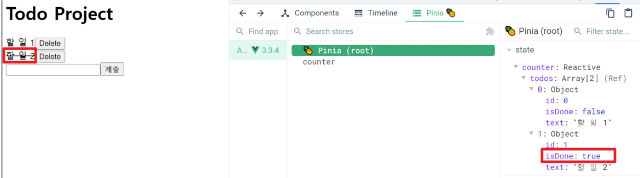

## Computed Todo
- todos 배열의 길이 값을 반환하는 함수 doneTodosCount 작성 (getters)
  ```javascript
  // stores/counter.js

  const doneTodosCount = computed(() => {
    return todos.value.filter((todo) => todo.isDone).length
  })

  return { todos, addTodo, deleteTodo, updateTodo, doneTodosCount }
  ```

- App 컴포넌트에서 doneTodosCount getter를 참조
  ```vue
  <template>
    <div>
      <h1>Todo PJT</h1>
      <h2>완료된 Todo: {{ store.doneTodosCount }}</h2>
      <TodoForm />
      <TodoList />
    </div>
  </template>

  <script setup>
  import TodoForm from '@/components/TodoForm.vue'
  import TodoList from '@/components/TodoList.vue'
  import { useCounterStore } from '@/stores/counter'

  const store = useCounterStore()
  </script>

  <style scoped></style>
  ```

## Local Storage
- 브라우저 내에 key-value 쌍을 저장하는 웹 스토리지 객체

### Local Storage 특징
- 페이지를 새로 고침하고 브라우저를 다시 실행해도 데이터가 유지
- 쿠키와 다르게 네트워크 요청 시 서버로 전송되지 않음
- 여러 탭이나 창 간에 데이터를 공유 할 수 있음

### Local Storage 사용 목적
- 웹 애플리케이션에서 사용자 설정, 상태 정보, 캐시 데이터 등을 클라이언트 측에서 보관하여 웹사이트의 성능을 향상시키고 사용자 경험을 개선하기 위함

### pinia-plugin-persistedstate
- Pinia의 플러그인(plugin) 중 하나
- 웹 애플리케이션의 상태(state)를 브라우저의 local storage나 session storage에 영구적으로 저장하고 복원하는 기능을 제공
- https://prazdevs.github.io/pinia-plugin-persistedstate/

### pinia-plugin-persistedstate 설정
- 설치 및 등록

  ```termianl
  $ npm i pinia-plugin-persistedstate
  ```

  ```javascript
  // main.js

  import piniaPluginPersistedstate from 'pinia-plugin-persistedstate'

  const app = createApp(App)
  const pinia = createPinia()

  pinia.use(piniaPluginPersistedstate)

  // app.use(createPinia())
  app.use(pinia)

  app.mount('#app')
  ```

- 활용
  - defineStore의 3번째 인자로 관련 객체 추가
  
  ```javascript
  // stores/counter.js

  export const useCounterStore = defineStore('counter', () => {
    ...,
    return { todos, addTodo, deleteTodo, updateTodo, doneTodosCount }
  }, { persist: true })
  ```

- 적용 결과
  - 브라우저의 Local Storage에 저장되는 todos 상태

  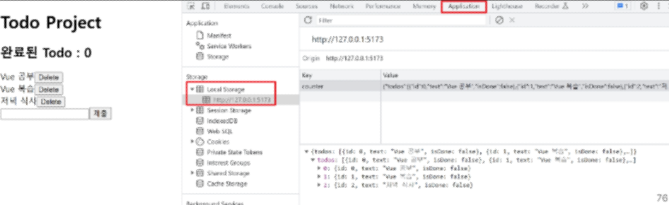

<br>
<br>

# 참고

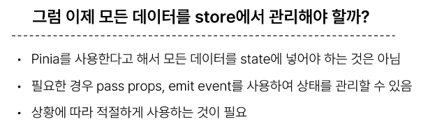

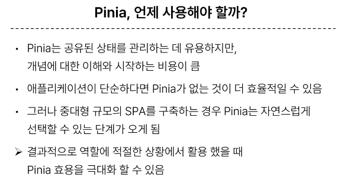