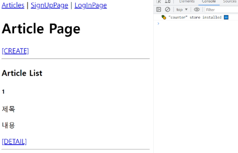

# Vue with DRF 2

# INDEX
1. [DRF Authentication](#1-drf-authentication)
   1. [Authentication](#authentication)
   2. [인증 체계 설정](#인증-체계-설정)
   3. [TokenAuthentication 설정](#tokenauthentication-설정)
   4. [Dj-Rest-Auth 라이브러리](#dj-rest-auth-라이브러리)
   5. [Token 발급 및 활용](#token-발급-및-활용)
   6. [권한 정책 설정](#권한-정책-설정)
   7. [IsAuthenticated 권한](#isauthenticated-권한-설정)
2. [Authentication with Vue](#2-authentication-with-vue)
   1. [회원가입](#회원가입)
   2. [로그인](#로그인)
   3. [요청과 토큰](#요청과-토큰)
   4. [인증 여부 확인](#인증-여부-확인)
   5. [기타 기능 구현](#기타-기능-구현)
3. [참고](#참고)

<br>
<br>

# 1. DRF Authentication

## Authentication(인증)

### Authentication(인증)
- 수신된 요청을 해당 요청의 사용자 또는 자격 증명과 연결하는 메커니즘
  - 누구인지를 확인하는 과정

### Permissions(권한)
- 요청에 대한 접근 허용 또는 거부 여부를 결정

### 인증과 권한
- 인증이 먼저 진행되며 수신 요청을 해당 요청의 사용자 또는 해당 요청이 서명된 토큰(token)과 같은 일련의 자격 증명과 연결
- 그런 다음 권한 및 제한 정책(throttling policies)은 인증이 완료된 해당 자격 증명을 사용하여 요청을 허용해야 하는 지를 결정

### DRF에서의 인증
- 인증은 항상 view 함수 시작 시, 권한 및 제한 확인이 발생하기 전, 다른 코드의 진행이 허용되기 전에 실행됨
- https://www.django-rest-framework.org/api-guide/authentication/
  - 인증 자체로는 들어오는 요청을 허용하거나 거부할 수 없으며, 단순히 요청에 사용된 자격 증명만 식별한다는 점에 유의

### 승인되지 않은 응답 및 금지된 응답
- 인증되지 않은 요청이 권한을 거부하는 경우 해당되는 두 가지 오류 코드가 응답

1. HTTP 401 Unauthorized
   - 요청된 리소스에 대한 유효한 인증 자격 증명이 없기 때문에 클라이언트 요청이 완료되지 않았음을 나타냄

2. HTTP 403Forbidden (Permission Denied)
   - 서버에 요청이 전달되었지만, 권한 때문에 거절되었다는 것을 의미
   - 401과 다른 점은 서버는 클라이언트가 누구인지 알고 있음

## 인증 체계 설정

### 1. 전역 설정
- DEFAULT_AUTHENTICATION_CLASSES를 사용
- 사용 예시

  

### 2. View 함수 별 설정
- authentication_classes 데코레이터를 사용
- 사용 예시

  

### DRF가 제공하는 인증 체계
1. BasicAuthentication
2. **TokenAuthentication**
3. SessionAuthentication
4. RemoteUserAuthentication

### TokenAuthentication
- 간단한 token 기반 HTTP 인증 체계
- 기본 데스크톱 및 모바일 클라이언트와 같은 클라이언트-서버 설정에 적합
- https://www.django-rest-framework.org/api-guide/authentication/#tokenauthentication
  - 서버가 사용자에게 토큰을 발급하여 사용자는 매 요청마다 발급받은 토큰을 요청과 함께 보내 인증 과정을 거침

## TokenAuthentication 설정

### TokenAuthentication 적용 과정
1. 인증 클래스 설정
   - TokenAuthentication 활성화 코드 주석 해제
   - 기본적으로 모든 view 함수가 토큰 기반 인증이 진행될 수 있도록 설정하는 것

      

2. INSTALLED_APPS 추가
   - rest_framework.authoken에 추가

      

3. Migrate 진행

4. 토큰 생성 코드 작성
   - accounts/signals.py 생성
     - 모든 사용자가 자동으로 생성된 토큰을 가지도록 하는 역할

    

## Dj-Rest-Auth 라이브러리

### Dj-Rest-Auth
- 회원가입, 인증(소셜미디어 인증 포함), 비밀번호 재설정, 사용자 세부 정보 검색, 회원 정보 수정 등 다양한 인증 관련 기능을 제공하는 라이브러리
- https://github.com/iMerica/dj-rest-auth

### Dj-Rest-Auth 설치 및 적용
- 설치
  ```
  $ pip install dj-rest-auth
  ```

- INSTALLED_APPS 등록

  

- 프로젝트 urls.py 등록

  

### Dj-Rest-Auth의 Registration(등록) 기능 추가 설정
1. 패키지 추가 설치
  ```
  $ pip install 'dj-rest-auth[with_social]'
  ```

2. 추가 App 등록
  
  

3. 추가 URL 등록

  

4. Migrate

- https://dj-rest-auth.readthedocs.io/en/latest/installation.html#registration-optional

## Token 발급 및 활용

### Token 발급
- 회원 가입 및 로그인을 진행하여 토큰 발급 테스트하기
- 라이브러리 추가로 인해 작성 된 URL 목록 확인
- http://127.0.0.1:8000/accounts/

  

- 회원 가입 잰행 (하단 회원 가입 form 사용)
- http://127.0.0.1:8000/accounts/signup/

  

- 로그인 진행 (하단 로그인 form 사용)
- http://127.0.0.1:8000/accounts/login/

  

- 로그인 성공 후 DRF로 부터 발급 받은 Token 확인
- **이 Tokken을 Vue에서 별도로 저장하여 매 요청마다 함께 보내야 인증 됨**

  

### Token 활용
- 게시글 작성 과정을 통해 Token 사용 방법 익히기
- Postman을 활용해 게시글 작성 요청
  - http://127.0.0.1:8000/api/v1/articles/

- Body에 게시글 제목과 내용 입력
  - http://127.0.0.1:8000/api/v1/articles/

  

- Headers에 발급받은 Token 작성 후 요청 성공 확인
  - Key: `Authorization`
  - Value: `Token 토큰 값`
  
  

### 클라이언트가 Token으로 인증 받는 방법
1. '**Authorization**' HTTP Header에 포함
2. 키 앞에는 문자열 '**Token**'이 와야 하며 **공백으로 두 문자열을 구분해야 함**

  

### 발급 받은 Token을 인증이 필요한 요청마다 함께 보내야 함

## 권한 정책 설정

### 권한 설정 방법
1. 전역 설정
   - DEFAULT_PERMISSION_CLASSES를 사용
   - 사용 예시

      

    - 지정하지 않을 경우 이 설정은 기본적으로 무제한 액세스를 허용

      

2. View 함수 별 설정
   - permission_classes 데코레이터를 사용
   - 사용 예시

      

### DRF가 제공하는 권한 정책
1. **IsAuthenticated**
2. IsAdminUser
3. IsAuthenticatedOrReadOnly
4. ...

- https://www.django-rest-framework.org/api-guide/permissions/#api-reference

### IsAuthenticated 권한
- 인증되지 않은 사용자에 대한 권한을 거부하고 그렇지 않은 경우 권한을 허용
- 등록된 사용자만 API에 액세스할 수 있도록 하려는 경우에 적합

## IsAuthenticated 권한 설정

### 권한 설정
- DEFAULT_PERMISSION_CLASSES 설정
  - 기본적으로 모든 View 함수에 대한 접근을 허용

  

- permission_classes 관련 코드 주석 해제
  - 전체 게시글 조회 및 생성시에만 인증된 사용자만 진행 할 수 있도록 권한 설정

  

### 권한 활용
- 만약 관리자만 전체 게시글 조회가 가능한 권한이 설정되었을 때, 인증된 일반 사용자가 조회 요청을 할 경우 응답 확인하기
- 테스트를 위해 임시로 관리자 관련 권한 클래스로 변경

  

- 전체 게시글 조회 요청
  - http://127.0.0.1:8000/api/v1/articles/
- 403 Forbidden

  

- IsAuthenticated 권한으로 복구

  

<br>
<br>

# 2. Authentication with Vue

### 시작하기 전에
- 정상 작동하던 게시글 전체 조회가 작동하지 않음
- 401 status code 확인
  - 게시글 조회 요청 시 인증에 필요한 수단(token)을 보내지 않고 있으므로 게시글 조회가 불가능해진 것

  

## 회원가입

### 회원가입 로직 구현
- router 코드 작성

  

- App 컴포넌트에 SignUpView 컴포넌트로 이동하는 RouterLink 작성

  

- 회원가입 form 작성

  

- 사용자 입력 데이터와 바인딩 될 반응형 변수 작성

  

- SignUpView 컴포넌트 출력 확인

  

- 회원가입 요청을 보내기 위한 signUp 함수가 해야 할 일
  1. 사용자 입력 데이터를 받아
  2. 서버로 회원가입 요청을 보냄

  

- 컴포넌트에 사용자 입력 데이터를 저장 후 store의 signUp 함수를 호출하는 함수 작성

  

- 실제 회원가입 요청을 보내는 store의 signUp 함수 작성

  

- 회원가입 테스트

  

- DB 확인

  

## 로그인

### 로그인 로직 구현
- LogInView route 코드 작성

  

- App 컴포넌트에 LogInView 컴포넌트로 이동하는 RouterLink 작성

  

- 로그인 form 작성

  

- 사용자 입력 데이터와 바인딩 될 반응형 변수 작성

  

- LogInView 컴포넌트 출력 확인

  

- 로그인 요청을 보내기 위한 logIn 함수가 해야 할 일
  1. 사용자 입력 데이터를 받아
  2. 서버로 로그인 요청 및 응답 받은 **토큰 저장**

  

- 컴포넌트에 사용자 입력 데이터를 저장 후 store의 login 함수를 호출하는 함수 작성

  

- 실제 로그인 요청을 보내는 store의 logIn 함수 작성

  

- 로그인 테스트
- 응답 객체에 발급된 Token이 함께 온 것을 확인

  

## 요청과 토큰

### Token을 store에 저장하여 인증이 필요한 요청마다 함께 보낸다.

### 토큰 저장 로직 구현
- 반응형 변수 선언 및 토큰 저장

  

- 다시 로그인 요청 후 저장된 토큰 확인

  

### 토큰이 필요한 요청
1. 게시글 전체 목록 조회 with token
   - 게시글 전체 목록 조회 요청 함수 getArticles에 token 추가

      
  
   - 401 응답 메시지가 사라지고 게시글이 출력되는 것을 확인

      

2. 게시글 작성 with token
   - 게시글 전체 목록 조회 요청 함수 getArticles에 token 추가
  
      

   - 게시글 작성 확인

      

## 인증 여부 확인

### 사용자의 인증(로그인) 여부에 따른 추가 기능 구현
1. 인증 되지 않은 사용자
   - 메인 페이지 접근 제한

2. 인증 된 사용자
   - 회원가입 및 로그인 페이지에 접근 제한

### 인증 상태 여부를 나타낼 속성 값 지정
- token 여부에 따라 로그인 상태를 Boolean 값으로 나타낼 isLogin 변수 작성
- computed를 활용해 token 값이 변할 때만 계산하도록 함

  

### 1. 인증 되지 않은 사용자는 메인 페이지 접근 제한
- 전역 네비게이션 가드 beforeEach를 활용해 다른 주소에서 메인 페이지로 이동 시 인증 되지 않은 사용자라면 로그인 페이지로 이동시키기

  

- 브라우저 local storage에서 token을 삭제 후 메인 페이지 접속 시도

  

### 2. 인증 된 사용자는 회원가입과 로그인 페이지에 접근 제한
- 다른 주소에서 회원가입 또는 로그인 페이지로 이동 시 이미 인증 된 사용자라면 메인 페이지로 이동시키기

  

- 로그인 후 회원가입, 로그인 페이지 접속 시도

  

## 기타 기능 구현

### 자연스러운 애플리케이션을 위한 기타 기능 구현
1. 로그인 성공 후 자동으로 메인 페이지로 이동하기

  

2. 회원가입 성공 후 자동으로 로그인까지 진행하기

  

<br>
<br>

# 참고


