# Vue with DRF 1

# INDEX
1. [프로젝트 개요](#1-프로젝트-개요)
   1. [DRF 프로젝트 안내](#drf-프로젝트-안내)
   2. [Vue 프로젝트 안내](#vue-프로젝트-안내)
2. [메인 페이지 구현](#2-메인-페이지-구현)
   1. [state 참조 및 출력](#state-참조-및-출력)
   2. [state with DRF](#state-with-drf)
3. [CORS Policy](#3-cors-policy)
   1. [CORS](#cors)
   2. [CORS Headers 설정](#cors-headers-설정)
4. [Article CR 구현](#4-article-cr-구현)
   1. [전체 게시글 조회](#전체-게시글-조회)
   2. [단일 게시글 조회](#단일-게시글-조회)
   3. [게시글 작성](#게시글-작성)

<br>
<br>

# 1. 프로젝트 개요

## DRF 프로젝트 안내
- 외부 패키지 및 라이브러리는 requirements.txt에 작성되어 있음

- 가상 환경 생성 및 활성화
  ```
  $ python -m venv venv
  $ source venv/Scripts/activate
  ```

- 패키지 설치
  ```
  $ pip install -r requirements.txt
  ```

- Migration 진행
  ```
  $ python manage.py makemigrations
  $ python manage.py migrate
  ```

- Fixtures 데이터 로드
  ```
  $ python manage.py loaddata articles.json
  ```

- Django 서버 실행 후, 전체 게시글 조회
  - http://127.0.0.1:8000/api/v1/articles/

    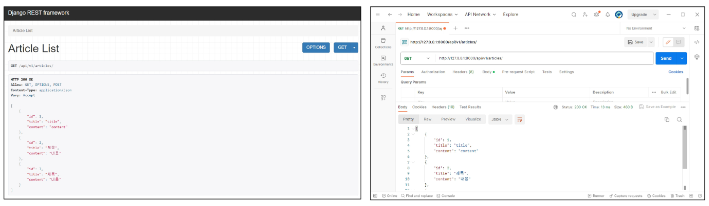

## Vue 프로젝트 안내
- Vite를 사용해 Pinia 및 Vue Router가 추가 되어있음
- pinia-plugin-persistedstate가 설치 및 등록 되어있음

- 컴포넌트 구조
  
  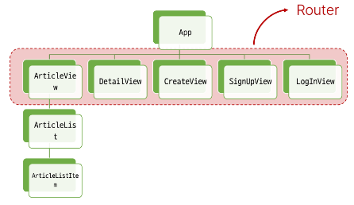

- 패키지 설치
  ```
  $ npm install
  ```

- 서버 실행
  ```
  $ npm run dev
  ```

<br>
<br>

# 2. 메인 페이지 구현

### Before Start
- 무결점의 프로젝트를 만드는 것이 아님
- front-end 프레임워크와 back-end 프레임워크 간의 요청과 응답, 그 과정에서 등장하는 새로운 개념과 문제를 해결하면서 하나의 웹 애플리케이션 서비스를 구현하는 과정에 집중

## state 참조 및 출력

### 개요
- ArticleView 컴포넌트에 ArticleList 컴포넌트와 ArticleListItem 컴포넌트 등록 및 출력하기
- ArticleList와 ArticleListItem은 각각 게시글 출력을 담당

### state 참조 및 출력
- ArticleView route

  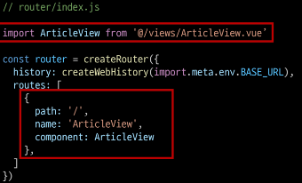

- App 컴포넌트에 ArticleView 컴포넌트로 이동하는 RouterLink 작성

  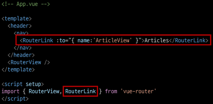

- ArticleView 컴포넌트에 ArticleList 컴포넌트 등록

  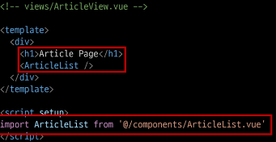

- store에 임시 데이터 articles 배열 작성하기

  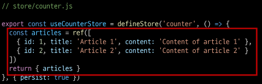

- ArticleList 컴포넌트에서 게시글 목록 출력
- store의 articles 데이터 참조
- v-for를 활용하여 하위 컴포넌트에서 사용할 article 단일 객체 정보를 props로 전달

  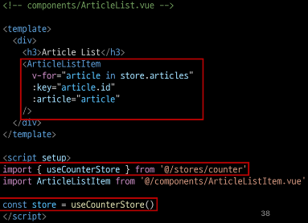

- ArticleListItem 컴포넌트는 내려 받은 props 를 정의 후 출력

  

- 메인 페이지 게시글 목록 출력 확인

  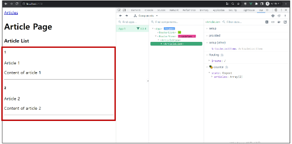

## state with DRF

### 개요
- 이제는 임시 데이터가 아닌 DRF 서버에 직접 요청하여 데이터를 응답 받아 store에 저장 후 출력하기

### state with DRF
- DRF 서버로의 AJAX 요청을 위한 axios 설치 및 관련 코드 작성

  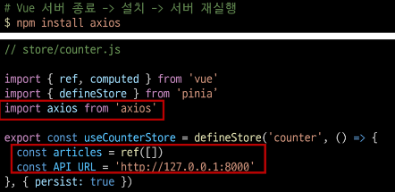

- DRF 서버로 요청을 보내고 응답 데이터를 처리하는 getArticles 함수 작성

  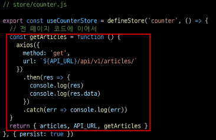

- ArticleView 컴포넌트가 마운트 될 때 getArticles 함수가 실행되도록 함
  - 해당 컴포넌트가 렌더링 될 때 항상 최신 게시글 목록을 불러오기 위함

  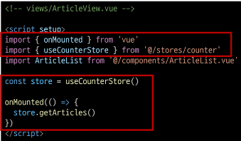

- Vue와 DRF 서버를 모두 실행한 후 응답 데이터 확인
  - 에러 발생

  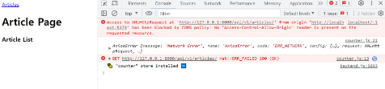

- 그런데 DRF 서버 측에서 문제 없이 응답했음 (200 OK)
  - 서버는 응답했으나 브라우저 측에서 거절한 것

  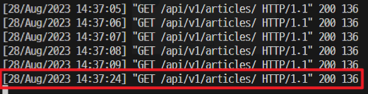

- 브라우저가 거절한 이유
  
  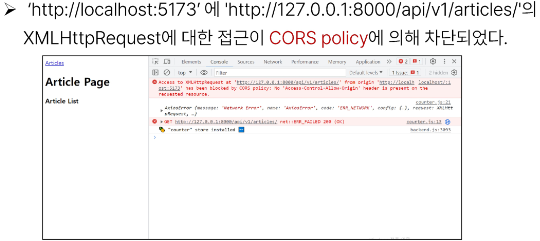

<br>
<br>

# 3. CORS Policy

## CORS

### SOP(Same-origin policy) - 동일 출처 정책
- 어떤 출처(Origin)에서 불러온 문서나 스크립트가 다른 출처에서 가져온 리소스와 상호 작용하는 것을 제한하는 보안 방식
- https://developer.mozilla.org/en-US/docs/Web/Security/Same-origin_policy
- 웹 애플리케이션의 도메인이 다른 도메인의 리소스에 접근하는 것을 제어하여 사용자의 개인 정보와 데이터의 보안을 보호하고, 잠재적인 보안 위협을 방지
- 잠재적으로 해로울 수 있는 문서를 분리함으로써 공격받을 수 있는 경로를 줄임

### Origin (출처)
- URL의 Protocol, Host, Port를 모두 포함하여 "출처"라고 부름
- Same Origin 예시
  - **아래 세 영역이 일치하는 경우에만 동일 출처(Same-origin)**로 인정

  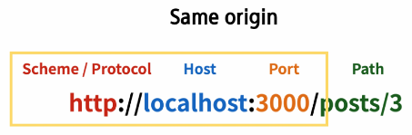

- Same Origin 예시
  
  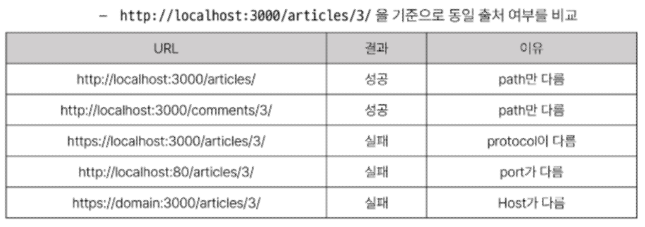

### CORS policy의 등장
- 기본적으로 웹 브라우저는 같은 출처에만 요청하는 것을 허용하며, 다른 출처로의 요청은 보안상의 이유로 차단됨
  - SOP에 의해 다른 출처의 리소스와 상호작용 하는 것이 기본적으로 제한되기 때문
- 하지만 현대 웹 애플리케이션은 다양한 출처로부터 리소스를 요청하는 경우가 많기 때문에 CORS 정책이 필요하게 되었음
- **CORS**는 웹 서버가 리소스에 대한 서로 다른 출처 간 접근을 허용하도록 선택할 수 있는 기능을 제공

### CORS(Cross-Origin Resource Sharing) - 교차 출처 리소스 공유
- 특정 출처(Origin)에서 실행 중인 웹 애플리케이션이 **다른 출처의 자원에 접근할 수 있는 권한을 부여**하도록 브라우저에 알려주는 체제
  - 만약 다른 출처의 리소스를 가져오기 위해서는 이를 제공하는 서버가 브라우저에게 다른 출처지만 접근해도 된다는 사실을 알려야 함
  - "CORS policy (교차 출처 리소스 공유 정책)"

### CORS policy (교차 출처 리소스 공유 정책)
- 다른 출처에서 온 리소스를 공유하는 것에 대한 정책
- 서버에서 설정되며, 브라우저가 해당 정책을 확인하여 요청이 허용되는지 여부를 결정
- 다른 출처의 리소스를 불러오려면 그 출처에서 올바른 **CORS header를 포함한 응답을 반환**해야 함
- https://developer.mozilla.org/ko/docs/Web/HTTP/CORS

### CORS 적용 방법

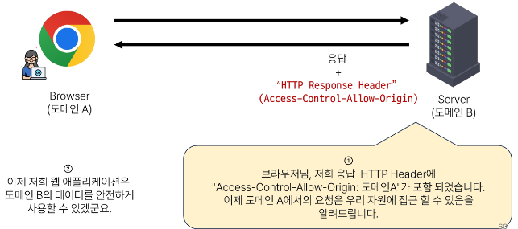

## CORS Headers 설정
- Django에서는 django-cors-headers 라이브러리를 활용
  - 손쉽게 응답 객체에 CORS header를 추가해주는 라이브러리
- https://github.com/adamchainz/django-cors-headers

### django-cors-headers 사용하기
- 설치
  ```
  $ pip install django-cors-headers
  ```

- settings.py에 INSTALLED_APPS에 등록 및 MIDDLEWARE에 등록
  ```python
  # settings.py

  INSALLED_APPS = [
    ...
    'corsheaders',
    ...
  ]

  MIDDLEWARE = [
    ...
    'corsheaders.middleware.CorsMiddleware',
    'django.middleware.common.CommonMiddleware',
    ...
  ]
  ```

- CORS를 허용할 Vue 프로젝트의 Domain 등록
  ```python
  # settings.py

  CORS_ALLOWED_ORIGINS = [
    'http://127.0.0.1:5173',
    'http://localhost:5173',
  ]
  ```

### CORS 처리 결과
- 메인 페이지에서 DRF 응답 데이터 재확인

  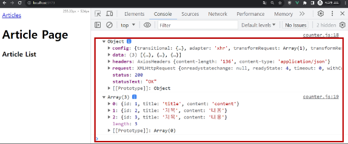

  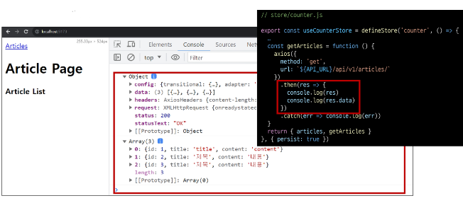

- 응답 객체에서 'Access-Control-Allow-Origin' Header 확인

  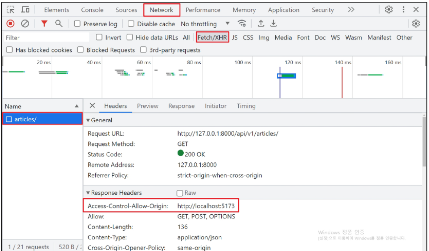

<br>
<br>

# 4. Article CR 구현

## 전체 게시글 조회

### 전체 게시글 목록 저장 및 출력
- 응답 받은 데이터에서 각 게시글의 구조 확인 (id, title, content)
  
  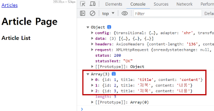

- store에 게시글 목록 데이터 저장
  
  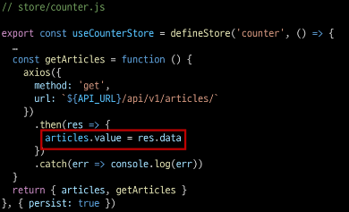

- store에 저장된 게시글 목록 출력 확인
- pinia-plugin-persistedstate에 의해 브라우저의 Local Storage에 저장됨

  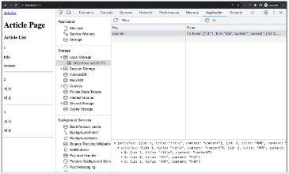

## 단일 게시글 조회

### 단일 게시글 데이터 출력
- DetailVue 관련 route

  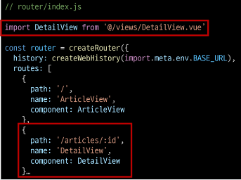

- ArticleListItem에 DetailView 컴포넌트로 가기 위한 RouterLink 작성

  

- DetailView가 마운트 될 때 특정 게시글을 조회하는 AJAX 요청 진행

  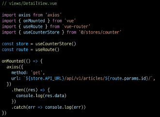

- 응답 데이터 확인

  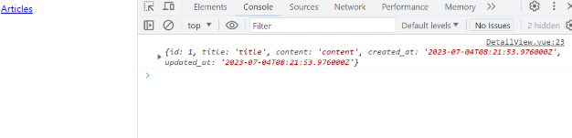

- 응답 데이터 저장 후 출력

  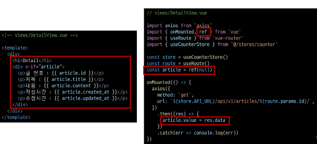

- 결과 확인

  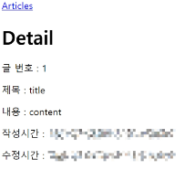

## 게시글 작성

- CreateView 관련 route

  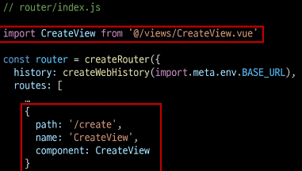

- ArticleView에 CreateView 컴포넌트로 가기 위한 RouterLink 작성

  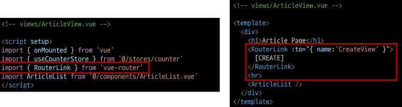

- v-model을 사용해 사용자 입력 데이터를 양방향 바인딩
- v-model의 trim 수식어를 사용해 사용자 입력 데이터의 공백을 제거

  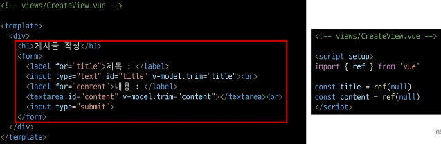

- 양방향 바인딩 데이터 입력 확인

  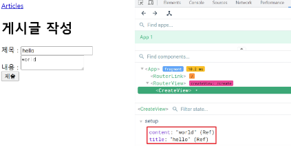

- 게시글 생성 요청을 담당하는 createArticle 함수 작성
- 게시글 생성이 성공한다면 ArticleView 컴포넌트로 이동

  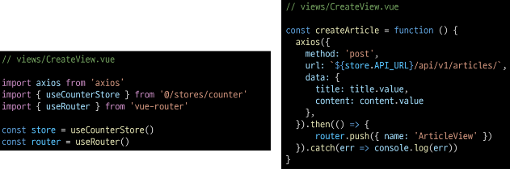

- submit 이벤트가 발생하면 createArticle 함수를 호출
- v-on의 prevent 수식어를 사용해 submit 이벤트의 기본 동작(새로고침) 취소

  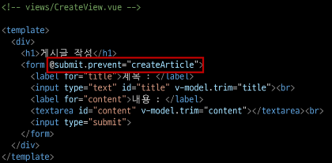

- 게시글 생성 결과 확인

  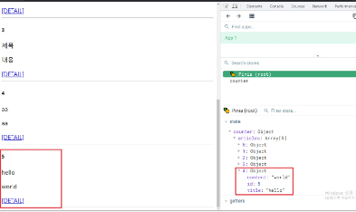

- 서버 측 DB 확인

  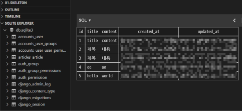