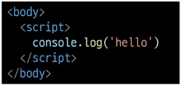
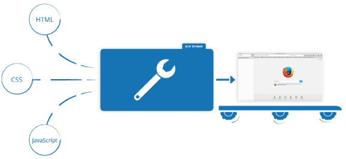
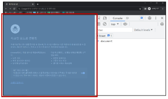
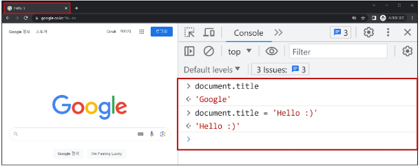
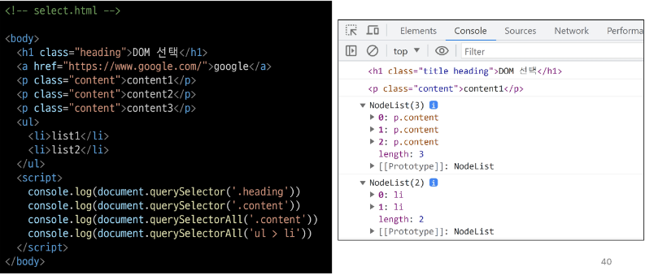
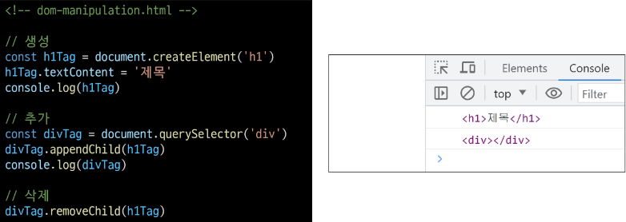
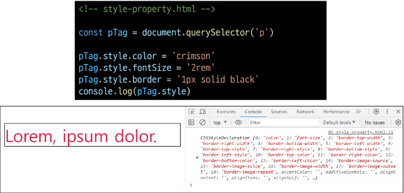
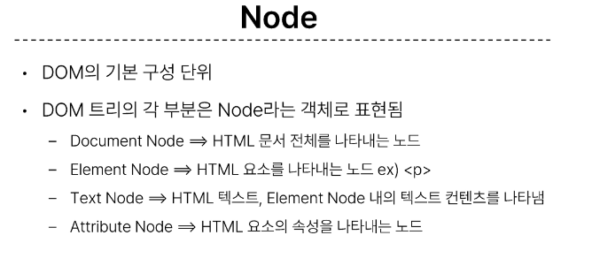
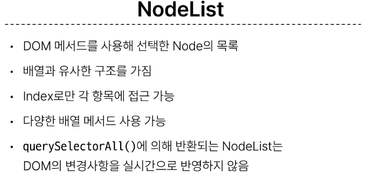
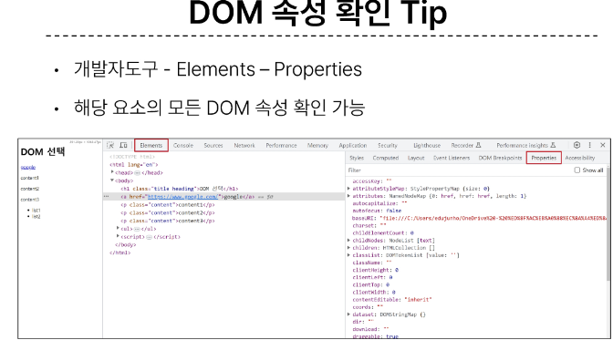

# JavaScript and DOM

# INDEX
1. Java Script and DOM
  - [DOM](#dom)
  - [DOM 선택](#dom-선택)
  - [DOM 조작](#dom-조작)

# 1. JavaScript and DOM

# DOM

## 개요

### 웹 브라우저에서의 JavaScript
- 웹 페이지의 동적인 기능을 구현

### JavaScript 실행 환경 종류
1. HTML script태그
  
2. js 확장자 파일
  
3. 브라우저 Console
  

### DOM - The Document Object Model
- 웹 페이지(Document)를 구조화된 객체로 제공하여 프로그래밍 언어가 페이지 구조에 접근할 수 있는 방법을 제공
- 문서 구조, 스타일, 내용 등을 변경할 수 있도록 함

### DOM 특징
- DOM에서 모든 요소, 속성, 텍스트는 하나의 객체
- 모두 document 객체의 자식으로 구성됨
  

### DOM tree
- 브라우저는 HTML 문서를 해석하여 DOM tree라는 객체 트리로 구조화
- 객체 간 상속 구조가 존재
  

### 브라우저가 웹 페이지를 불러오는 과정
- 웹 페이지는 웹 브라우저를 통해 해석되어 웹 브라우저 화면에 나타남
  

### DOM 핵심
- 문서의 요소들을 객체로 제공하여 다른 프로그래밍 언어에서 **접근하고 조작**할 수 있는 방법을 제공하는 API

## document 객체

### 'document'객체
- 웹 페이지 객체
- DOM Tree의 진입점
- 페이지를 구성하는 모든 객체 요소를 포함
  

### 'document'객체 예시
- HTML의 \<title>변경하기
  

# DOM 선택

### DOM 조작 시 기억해야 할 것
- 웹 페이지를 동적으로 만들기 == 웹 페이지를 조작하기
- 조작 순서
  1. 조작 하고자 하는 요소를 **선택**(또는 탐색)
  2. 선택된 요소의 콘텐츠 또는 속성을 **조작**

## 선택 메서드
- document.querySelector()
  - 요소 한 개 선택
- document.querySelectorAll()
  - 요소 여러 개 선택

### document.querySelector(selector)
- 제공한 선택자와 일치하는 element 한 개 선택
- 제공한 CSS selector를 만족하는 첫 번째 element 객체를 반환 (없다면 null 반환)

### document.querySelectorAll(selector)
- 제공한 선택자와 일치하는 여러 element를 선택
- 제공한 CSS selector를 만족하는 NodeList를 반환

### DOM 선택 실습
  

# DOM 조작

## 속성 조작
- 클래스 속성 조작
- 일반 속성 조작

### 클래스 속성 조작
'classList' property
- 요소의 클래스 목록을 DOMTokenList(유사 배열) 형태로 반환

### calssList 메서드
- element.clssList.add()
  - 지정한 클래스 값을 추가
- element.classList.remove()
  - 지정한 클래스 값을 제거
- element.classList.toggle()
  - 클래스가 존재한다면 제거하고 false를 반환(존재하지 않으면 클래스를 추가하고 true 반환)

### 클래스 속성 조작 실습
- add()와 remove() 메서드를 사용해 지정한 클래스 값을 추가 혹은 제거
  
- add()와 remove() 메서드를 사용해 지정한 클래스 값을 추가 혹은 제거
  

### 속성 조작 메서드
- Element.getAttribute()
  - 해당 요소에 지정된 값을 반환 (조회)
- Element.setAttribute(name, value)
  - 지정된 요소의 속성 값을 설정
  - 속성이 이미 있으면 기존 값을 갱신 (그렇지 않으면 지정된 이름과 값으로 샛 속성이 추가)
- Element.removeAttribute()
  - 요소에서 지정된 이름을 가진 속성 제거

### 속성 조작 실습
  

## HTML 콘텐츠 조작
- 'textContent' property
  - 요소의 콘텐츠를 표현
    - \
lorem\

- js의 style과 css의 style이름이 다를 수 있으니 꼭 확인하고 바꿀 것!

### HTML 콘텐츠 조작 실습
  

## DOM 요소 조작
- document.createElement(tagName)
  - 작성한 tagName의 HTML 요소를 생성하여 반환
- Node.appendChild()
  - 한 Node를 특정 부모 Node의 자식 NodeList 중 마지막 자식으로 삽입
  - 추가된 Node 객체를 반환
- Node.removeChild()
  - DOM에서 자식 Node를 제거
  - 제거된 Node를 반환

### DOM 요소 조작 실습
  

## style 조작
- 'style' property
- 해당 요소의 모든 style속성 목록을 포함하는 속성

### style 조작 실습
  

# 참고

### MDN문서를 보고 공부할 것