# Basic syntax of JavaScript

 
 

# INDEX

  1. [변수](#1-변수)
  2. [데이터 타입](#2-데이터-타입)
  3. [연산자](#3-연산자)
  4. [조건문](#4-조건문)
  5. [반복문](#5-반목문)
  6. [참고](#참고)

 
 

# 1. 변수

### JavaScript 문법 학습
  - ECMAScript 2015(ES6) 이후의 명제를 따름
    - 이후 개인 학습시 (ES6+가 붙어있는 교재 혹은 강의를 이용할 것)
  - 권장 스타일 가이드
    - https://standardjs.com/rules-kokr.html

### 식별자(변수명) 작성 규칙
  - 반드시 문자, 달러($) 또는 밑줄(_)로 시작
  - 대소만자를 구분
  - 예약어 사용 불가
    - for, if function 등
  - 카멜 케이스(camelCase)
    - 변수, 객체, 함수에 사용
  - 파스칼 케이스(PascalCase)
    - 클래스, 생성자에 사용
  - 대문자 스네이크 케이스(SNAKE_CASE)
    - 상수(constants)에 사용
  
### 변수 선언 키워드
  1. let
  2. const
  3. var

### let
  - 블록 스코프(block scope - 중괄호)를 갖는 지역 변수를 선언
  - 재할당 가능
  - 재선언 불가능
  - ES6에서 추가 
  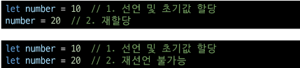

### const
  - 블록 스코프를 갖는 지역 변수를 선언
  - 재할당 불가능
  - 재선언 불가능
  - ES6에서 추가 
    

### 블록 스코프(block scope)
  - if, for, 함수 등의 '중괄호({}) 내부'를 가리킴(영역)
    - 파이썬에서는 들여쓰기로 구분했었음
  - 블록 스코프를 가지는 변수는 블록 바깥에서 접근 불가능
    - 지역변수가 없을 경우 전역변수를 사용(파이썬과 동일) 
    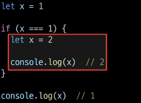

### 변수 선언 키워드 정리
  - 기본적으로 const 사용을 권장
  - 재할당이 필요한 변수는 let으로 변경해서 사용
    - const를 사용하다가 경우에 따라 let으로 변경

 
 

# 2. 데이터 타입

### 원시 자료형(Primitive type)
  - Number(int, float으로 구분하지 않음), String, Boolean, undefined, null
  - 변수에 값이 직접 저장되는 자료형 (불변, 값이 복사)

### 참조 자료형(Reference type)
  - Objects(Object, Array, Function)
  - 객체의 주소가 저장되는 자료형 (가변, 주소가 복사)

### 원시 자료형 예시
  - 변수에 할당될 때 값이 복사됨
    - 변수 간에 서로 영향을 미치지 않음 
    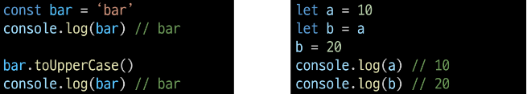

### 참조 자료형 예시
  - 객체를 생성하면 객체의 메모리 주소를 변수에 할당
    - 변수 간에 서로 영향을 미침 
    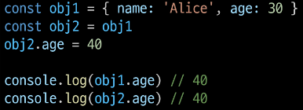

## 원시 자료형

### Number
  - 정수 또는 실수형 숫자를 표현하는 자료형 
  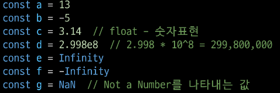

### String
  - 텍스트 데이터를 표현하는 자료형
  - '+' 연산자를 사용해 문자열끼리 결합
  - 곱셈, 나눗셈, 뺄셈 불가능 
  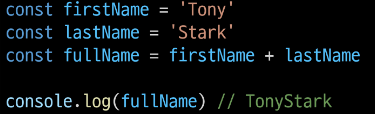

### Template Literals(템플릿 리터럴)
  - 내장된 표현식을 허용하는 문자열 작성 방식
  - Backtick(``)을 이용하며, 여러 줄에 걸쳐 문자열을 정의할 수도 있고 JavaScript의 변수를 문자열 안에 바로 연결할 수 있음
  - 표현식은 '$'와 중괄호(${experssion})로 표기
  - ES6+ 부터 지원 
  

### null
  - 변수의 값이 없음을 **의도적**으로 표현할 때 사용 
  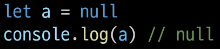

### undifined
  - 변수 선언 이후 직접 값을 할당하지 않으면 **자동으로 할당**됨 
  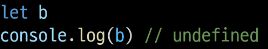

### '값이 없음'에 대한 표현이 null과 undefined 2가지인 이유
  - JavaScript의 설계 실수
  - null이 원시 자료형 임에도 불구하고 object로 출력되는 이유는 JavaScript 설계 당시의 버그를 해결하지 않은 것
    - 해결하지 못하는 이유는 이미 null 타입에 의존성을 띄고 있는 수 많은 프로그램들이 망가질 수 있기 때문 (하위 호환 유지) 
  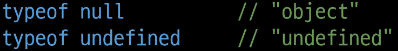

### Boolean (true/false)
  - 조건문 또는 반복문에서 Boolean이 아닌 데이터 타입은 "자동 형변환 규칙"에 따라 true 또는 false로 변환됨

### 자동 형변환
  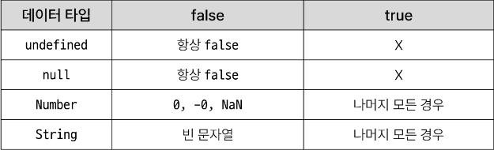

 
 

# 3. 연산자

### 할당 연산자
  - 오른쪽에 있는 피연산자의 평가 결과를 왼쪽 피연산자에 할당하는 연산자
  - 단축 연산자 지원 
  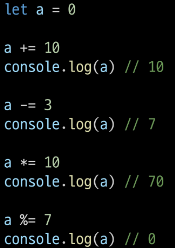

### 증가 & 감소 연산자
  - 증가 연산자 (++)
    - 피연산자를 증가(1을 더함)시키고 연산자의 위치에 따라 증가하기 전이나 후의 값을 반환
  - 감소 연산자 (--)
    - 피연산자를 감소(1을 뺌)시키고 연산자의 위치에 따라 감소하기 전이나 후의 값을 반환
  - **+= 또는 -=와 같이 더 명시적인 표현으로 작성하는 것을 권장**

### 비교 연산자
  - 피연산자들(숫자, 문자, Boolean 등)을 비교하고 결과 값을 boolean으로 반환하는 연산자 
  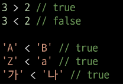

### 동등 연산자 (==)
  - 두 피연산자가 같은 값으로 평가되는지 비교 후 boolean 값을 반환
  - **'암묵적 타입 변환'**을 통해 타입을 일치시킨 후 같은 값인지 비교
  - 두 피연산자가 모두 객체일 경우 메모리의 같은 객체를 바라보는지 판별 
  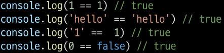

### 일치 연산자 (===) -> default
  - 두 피연산자의 **값과 타입이 모두 같은 경우** true를 반환
  - 같은 객체를 가리키거나, 같은 타입이면서 같은 값인지를 비교
  - **엄격한 비교**가 이뤄지며 암묵적 타입 변환이 발생하지 않음
  - 특수한 경우(대표적으로 null, undefined)를 제외하고는 동등 연산자가 아닌 **일치 연산자 사용 권장** 
  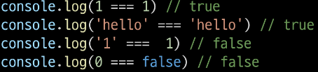

### 논리 연산자
  - and 연산
    -&&
  - or 연산
    - ||
  - not 연산
    - !
  - 단축 평가 지원(조건이 중간에 충족될 경우 뒤에 나오는 식을 스킵) 
  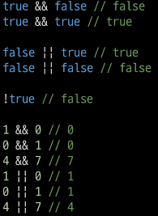

 
 

# 4. 조건문

### if
  - 조건 표현식의 결과값을 boolean 타입으로 변환 후 참/거짓을 판단 
  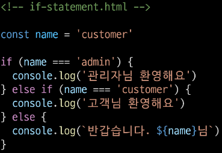

### 조건 (삼항) 연산자
  - 세 개의 피연산자를 받는 유일한 연산자
  - 앞에서부터 조건문, 물음표(?), 조건문이 참일 경우 실행할 표현식, 콜론(:), 조건문이 거짓일 경우 실행할 표현식이 배치 
  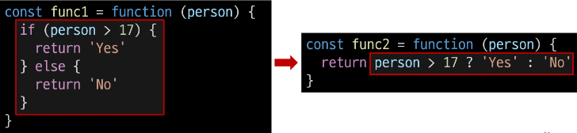

 
 

# 5. 반복문

### 반복문 종류
  - while
  - for
  - for ...in
  - for ...of

### while
  - 조건문이 참이면 문장을 계속해서 수행 
   
  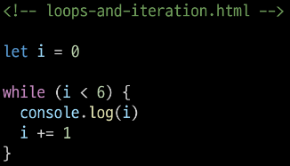

### for
  - 특정한 조건이 거짓으로 판별될 때까지 반복 
  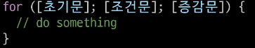 
  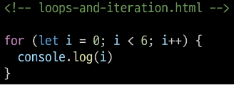
  - 동작 원리 
  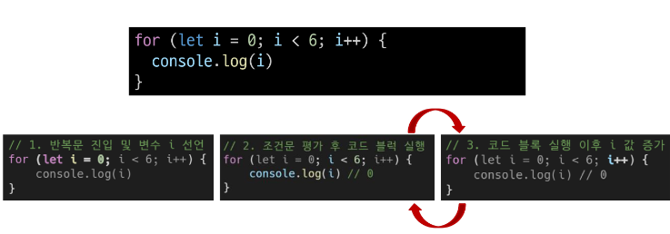

### for ...in -> objec에서만 사용
  - 객체의 **열거 가능한** 속성(property)에 대해 반복 
  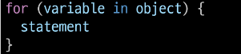 
  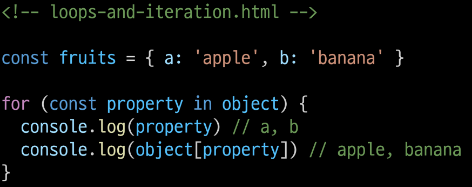

### for ...of
  - **반복 가능한** 객체(배열, 문자열 등)에 대해 반복 
  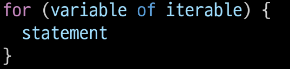 
  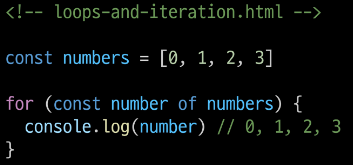

### 배열 반복과 for ...in
  - 배열의 인덱스는 정수 이름을 가진 열거 가능한 속성
  - for ...in은 정수가 아닌 이름과 속성을 포함하여 **열거 가능한 모든 속성을 반환**
  - 내부적으로 for ...in은 배열의 반복자 대신 **속성 열거를 사용하기 때문**(그대로 출력)에 **특정 순서에 따라 인덱스를 반환하는 것을 보장할 수 없음**
    - 인덱스의 순서가 중요한 **배열에서는 사용하지 않음**
    - 배열에서는 **for 반복, for ...of 반복을 사용** 
  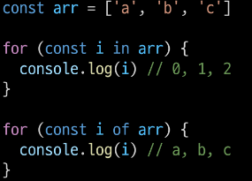

### for...in과 for...of
  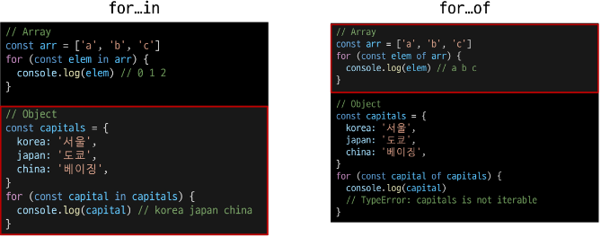

### 반복문 사용 시 const 사용 여부
  - for 문
    - for (let i = 0; i < arr.length; i++) { ... }의 경우에는 최초 정의한 i를 "재할당" 하면서 사용하기 때문에 **const를 사용하면 에러 발생**
  - for...in, for...of
    - 재할당이 아니라, 매 반복마다 다른 속성 이름이 변수에 지정되는 것이므로 **const를 사용해도 에러가 발생하지 않음**
    - **단, const 특징에 따라 블록 내부에서 변수를 수정할 수 없음**

### 반복문 종합
  - for...in, for...of 에서도 break, continue 사용가능 
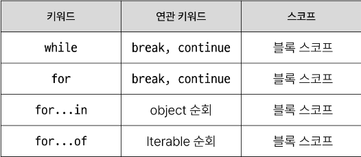

 
 

# 참고

### 세미콜론(semicolon)
  - 자바스크립트는 세미콜론을 선택적으로 사용 가능
  - 세미콜론이 없으면 ASI에 의해 자동으로 세미콜론이 삽입됨
    - ASI(Automatic Semicolon Insertion, 자동 세미콜론 삽입 규칙)
  - JavaScript를 만든 Brendan Eich또한 세미콜론 작성을 반대

### 변수 선언 키워드 - 'var'
  - ES6 이전에 변수 선언에 사용했던 키워드
  - 재할당 가능 & 재선언 가능
  - "호이스팅" 되는 특성으로 인해 예기치 못한 문제 발생 가능
    - 따라서 ES6 이후부터는 var 대신 const와 let을 사용하는 것을 권장
  - 함수 스코프(function scope)를 가짐
  - 변수 선언 시 var, const, let 키워드 중 하나를 사용하지 않으면 자동으로 var로 선언됨

### 함수 스코프(function scope)
  - 함수의 중괄호 내부를 가리킴
  - 함수 스코프를 가지는 변수는 함수 바깥에서 접근 불가능 
  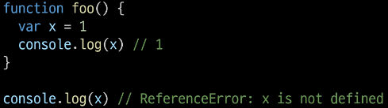

### 호이스팅(hoisting)
  - 변수를 선언 이전에 참조할 수 있는 형상
  - 변수 선언 이전의 위치에서 접근 시 undefined를 반환 
  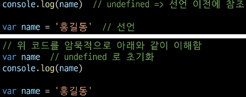
  - JavaScript에서 변수들은 실제 실행시에 코드의 최상단으로 끌어 올려지게 되며 (hoisted) 이러한 이유 때문에 var로 선언된 변수는 선언 시에 undefined로 값이 초기화되는 과정이 동시에 발생 
  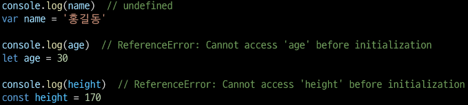

### NaN을 반환하는 경우 예시
  1. 숫자로서 읽을 수 없음 (Number(undefined))
  2. 결과가 허수인 수학 계산식 (Math.sqrt(-1))
  3. 피연산자가 NaN (7 ** NaN)
  4. 정의할 수 없는 계산식 (0 * Infinity)
  5. 문자열을 포함하면서 덧셈이 아닌 계산식 ('가' / 3)