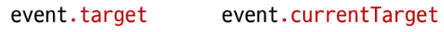

# Controlling event

# INDEX
  1. [이벤트](#1-이벤트)
  2. [event handler 활용](#2-event-handler-활용)

<br>
<br>

# 1. 이벤트

## 개요

### 일상속의 이벤트
  - 컴퓨터 키보드를 눌러 텍스트를 입력하는 것
  - 전화벨이 울려 전화가 왔음을 알리는 것
  - 손을 흔들어 인사한는 것
  - 전화기의 버튼을 눌러서 통화를 시작하는 것
  - 리모컨을 사용하여 채널을 변경하는 것

### 웹에서의 이벤트
  - 버튼을 클릭했을 때 팝업 창이 출력되는 것
  - 마우스 커서의 위치에 따라 드래그 앤 드롭하는 것
  - 사용자의 키보드 입력 값에 따라 새로운 요소를 생성하는 것
  - 일상에서의 이벤트처럼 웹에서도 **이벤트를 통해 특정 동작을 수행**한다.

## event
  - 무언가 일어났다는 신호, 사건
  - 모든 DOM 요소는 이러한 event를 만들어 냄

### event object
  - DOM에서 이벤트가 발생했을 때 생성되는 객체
  - 이벤트 종류
    - mouse, input, keyboard, touch...
    - https://developer.mozilla.org/en-US/docs/Web/API/Event
  
### DOM 요소는 evnt를 받고 받은 event를 '처리'(event handler-이벤트 처리기)할 수 있음

## event handler
  - 이벤트가 발생했을 때 실행되는 함수
  - 사용자의 행동에 어떻게 반응할지를 JavaScript 코드로 표현한 것

### .addEventListener()
  - 대표적인 이벤트 핸들러 중 하나
  - 특정 이벤트를 DOM 요소가 수신할 때마다 콜백 함수를 호출


### .addEventListener(type, handler)
  - type
    - 수신할 이벤트 이름
    - 문자열로 작성 (ex.'click')

  - handler
    - 발생한 이벤트 객체를 수신하는 콜백 함수
    - 콜백 함수는 발생한 Event object를 유일한 매개변수로 받음
    - this를 사용할 경우, **화살표 함수로 작성하면 안된다!**

### addEventListener 활용
  - "버튼을 클릭하면 버튼 요소 출력하기"
  - 버튼에 이벤트 처리기를 부착하여 클릭 이벤트가 발생하면 이벤트가 발생한 버튼정보를 출력<br>
  
  - 요소에 addEventListener를 부착하게 되면 내부의 this 값은 대상 요소를 가리키게 됨 (event 객체의 currnetTarget 속성 값과 동일)<br>
  

### addEventListener의 콜백 함수 특징
  - 발생한 이벤트를 나타내는 Event 객체를 유일한 매개변수로 받음
  - 아무것도 반환하지 않음<br>
  

## 버블링

### 버블링 개요
  - 핸들러는 form 요소에 할당되어 있지만 div나 p 요소 같은 중첩된 요소를 클릭해도 동작함
  - 왜 div나 p를 클릭했음에도 form에 할당된 핸들러가 동작하는가?<br>
  <br>
  

### 버블링 (Bubbling)
  - 한 요소에 이벤트가 발생하면, 이 요소에 할당된 핸들러가 동작하고, 이어서 부모 요소의 핸들러가 동작하는 현상
  - **가장 최상단의 조상 요소(document)를 만날 때까지** 이 과정이 반복되면서 요소 각각에 할당된 핸들러가 동작
  - 이벤트가 제일 깊은 곳에 있는 요소에서 시작해 부모 요소를 거슬러 올라가며 발생하는 것이 마치 물속 거품과 닮았기 때문

### 버블링 예시
  - 가장 안쪽의 \<p> 요소를 클릭하면 p -> div -> form 손서로 3개의 이벤트 핸들러가 동작<br>
  

### 이벤트가 정확히 어디서 발생했는지 접근할 수 있는 방법


### 'target' & 'currentTarget' 속성
  - 'target' 속성
    - 이벤트가 발생한 가장 안쪽의 요소(target)를 참조하는 속성
    - 실제 이벤트가 시작된 target 요소
    - 버블링이 진행 되어도 변하지 않음

  - 'currentTarget' 속성
    - '현재' 요소
    - 항상 이벤트 핸들러가 연결된 요소만을 참조하는 속성
    - 'this'와 같음 ==> this = event.currentTarget

### 'target' & 'currentTarget' 예시
  - 세 요소 중 가장 최상위 요소인 outerouter요소에만 이벤트 핸드러가 부착
  - 각 요소를 클릭 했을 때 event의 target과 currentTarget의 차이 비교<br>
  
  - 'target'
    - 실제 이벤트가 발생하는 요소를 가리킴
  - 'currentTarget'
    - 핸들러가 연결된 outerouter 요소만을 가리킴
  - 핸들러는 outerouter에 하나 밖에 없지만 이 핸들러에서 outerouter의 내부 모든 하위 요소에서 발생하는 클릭 이벤트를 잡아내고 있음
  - 클릭 이벤트가 어디서 발생했든 상관없이 outerouter까지 이벤트가 버블링 되어 핸들러를 실행시키기 때문<br>
  


<br>
<br>

# 2. event handler 활용

### event handler 활용 실습
  1. 버튼을 클릭하면 숫자를 1씩 등가해서 출력하기
  2. 사용자의 입력 값을 실시간으로 출력하기
  3. 사용자의 입력 값을 실시간으로 출력 '+'버튼을 클릭하면 출력한 값의 CSS 스타일을 변경하기
  4. todo 프로그램 구현
  5. 로또 번호 생성기 구현

### 1. click 이벤트 실습
  - 버튼을 클릭하면 숫자를 1씩 증가<br>
  
    
  ```html
  <!-- click-event.html -->

  <button id="btn">버튼</button>
  <p>클릭횟수 : <span id="counter">0</span></p>

  <script>
    // 1. 초기값 할당
    let countNumber = 0

    // 2. 버튼 요소 선택
    const btn = document.querySelector("#btn")

    // 3. 콜백 함수 (버튼에 클릭 이벤트가 발생할때마다 실행할 코드)
    const clickHandler = function () {
      // 3.1 초기값 += 1
      countNumber += 1
      // 3.2 p 요소를 선택
      const spanTag = document.querySelector('#counter')
      // 3.3 p 요소의 컨텐츠를 1 증가한 초기값으로 설정
      spanTag.textContent = countNumber
    }

    // 4. 버튼에 이벤트 핸들러 부착 (클릭 이벤트)
    btn.addEventListener('click', clickHandler)
  </script>
  ```

### 2. input 이벤트 실습
  - 사용자의 입력 값을 실시간으로 출력하기<br>
  

  ```html
  <!-- input-event.html -->

  <input type="text" id="text-input">
  <p></p>

  <script>
    // 1. input 요소 선택
    const inputTag = document.querySelector('#text-input')

    // 2. p 요소 선택
    const pTag = document.querySelector('p')

    // 3. 콜백 함수 (input 요소에 input 이벤트가 발생할때마다 실행할 코드)
    const InputHandler = function (event) {
      // 3.1 작성하는 데이터가 어디에 누적되고 있는지 찾기
      // console.log(event)
      // console.log(event.currentTarget)
      console.log(event.currentTarget.value)
      console.log(this.value)
      // 3.2 p요소의 컨텐츠에 작성하는 데이터를 추가
      pTag.textContent = event.currentTarget.value
    }

    // 4. input 요소에 이벤트 핸들러 부착 (input 이벤트)
    inputTag.addEventListener('input', InputHandler)
  </script>
  ```

### currentTarget 주의사항
  - console.log()로 event 객체를 출력할 경우 currentTarget 키의 값은 null을 가짐
  - currentTarget은 이벤트가 처리되는 동안에만 사용할 수 있기 때문
  - 대신 console.log(event.currentTarget)을 사용하여 콘솔에서 확인 가능
  - currentTarget 이후의 속성 값들은 **'target'을 참고해서 사용하기**<br>
  

### 3. click & input 이벤트 실습
  - 사용자의 입력 값을 실시간으로 출력 + 버튼을 클릭하면 출력한 값의 CSS 스타일을 변경하기<br>
  

  ```html
  <!-- click-input-event.html -->

  <h1></h1>
  <button id="btn">클릭</button>
  <input type="text" id="text-input">

  <script>
    // input 구현
    const inputTag = document.querySelector('#text-input')
    const h1Tag = document.querySelector('h1')

    const inputHandler = function (event) {
      h1Tag.textContent = event.currentTarget.value
    }

    inputTag.addEventListener('input', inputHandler)

    // click 구현
    const btn = document.querySelector('#btn')

    const clickHandler = function () {
      // console.log(event)
      // 1. add 방법
      h1Tag.classList.add('blue')

      // 2. toggle 방법
      h1Tag.classList.toggle('blue')

      // 3. if 방법
      if (h1Tag.classList.value) {
        h1Tag.classList.remove('blue')
      } else {
        h1Tag.classList.add('blue')
      }
    }

    btn.addEventListener('click', clickHandler)

  </script>
  ```

  ### 4. todo 실습
  

  ```html
  <!-- todo.html -->

  <input type="text" class="input-text">
  <button id="btn">+</button>
  <ul></ul>

  <script>
    // 1. 필요한 요소 선택
    const inputTag = document.querySelector('.input-text')
    const btn = document.querySelector('#btn')
    const ulTag = document.querySelector('ul')

    const addTodo = function (event) {
      // 2.1 사용자 입력 데이터 저장
      const inputData = inputTag.value
      // 2.2 데이터를 저장할 li 요소를 생성
      const liTag = document.createElement('li')
      // 2.3 li 요소 컨텐츠에 데이터 입력
      liTag.textContent = inputData
      // 2.4 li 요소를 부모 ul 요소의 자식 요소로 추가
      ulTag.appendChild(liTag)
      // 2.5 todo 추가 후 input의 입력 데이터는 초기화
      inputTag.value = ''
    }

    // 2. 버튼에 이벤트 핸들러를 부착
    btn.addEventListener('click', addTodo)
  </script>
  ```
  - todo 기능 추가
    1. 빈 문자열 입력 방지
    2. 입력이 없을 경우 경고 대화상자를 띄움

  

### 5. 로또 번호 생성기 실습


  ```html
  <!-- lottery.html -->

  <h1>로또 추천 번호</h1>
  <button id="btn">행운 번호 받기</button>
  <div></div>

  <!-- lodash 라이브러리 -->
  <script src="https://cdn.jsdelivr.net/npm/lodash@4.17.21/lodash.min.js"></script>
  
  <script>
    // 1. 필요한 요소 선택
    const btn = document.querySelector('#btn')
    const divTag = document.querySelector('div')

    // 2. 로또 번호를 생성 + 태그를 만들고 출력하는 함수 (콜백함수)
    const getLottery = function (event) {
      // 2.1 1부터 45까지의 값이 필요
      const numbers = _.range(1, 46)
      // 2.2 45개의 요소가 있는 배열에서 6개 번호 추출
      const sixNumbers = _.sampleSize(numbers, 6)
      // 2.5 6개의 li 요소를 담을 ul 요소 생성
      const ulTag = document.createElement('ul')
      // 2.3 추출한 번호 배열을 "반복"하면서 li 요소를 생성
      sixNumbers.forEach((number) => {
        // 2.4 번호를 담을 li 요소 생성 후 입력
        const liTag = document.createElement('li')
        liTag.textContent = number
        // 2.6 만들어진 li를 ul 요소에 추가
        ulTag.appendChild(liTag)
      });

      // 2.7 완성한 ul 요소를 div 요소에 추가
      divTag.appendChild(ulTag)
    }

    // 3. 버튼 요소에 이벤트 핸들러를 부착
    btn.addEventListener('click', getLottery)
  </script>
  ```

### lodash
  - 모듈성, 성능 및 추가 기능을 제공하는 JavaScript 유틸리티 라이브러리
  - array, object 등 자료구조를 다룰 때 사용하는 유용하고 간편한 함수들을 ㅔㅈ공
  - https://lodash.com/

## 이벤트 기본 동작 취소

### .preventDefault()
  - 해당 이벤트에 대한 기본 동작을 실행하지 않도록 지정

### 이벤트 동작 취소 실습
  - copy 이벤트 동작 취소<br>
  

  ```html
  <h1>중요한 내용</h1>

  <form id="my-form">
    <input type="text" name="username">
    <button type="submit">Submit</button>
  </form>

  <script>
    // 1
    const h1Tag = document.querySelector('h1')

    h1Tag.addEventListener('copy', function (event) {
      console.log(event)
      event.preventDefault()
      alert('복사 할 수 없습니다.')
    })
  </script>
  ```

  - form 제출 시 새로고침 동작 취소

  ```html
  <script>
  const formTag = document.querySelector('#my-form')

    const handleSubmit = function (event) {
      event.preventDefault()
    }

    formTag.addEventListener('submit', handleSubmit)
  </script>
  ```

## 참고

### addEventListener에서의 화살표 함수 주의사항
  - 화살표 함수는 자신만의 this를 가지지 않기 때문에 자신을 포함하고 있는 함수의 this를 상속받음
  