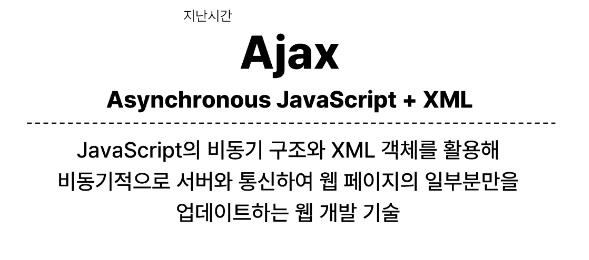
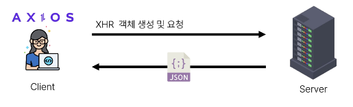
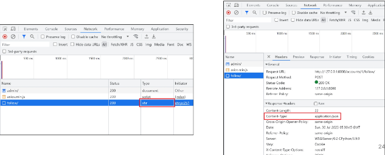
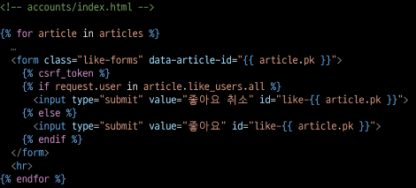
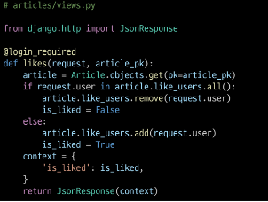
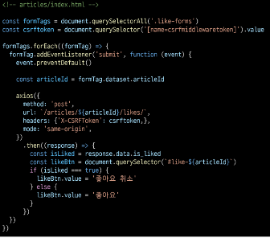

# Ajax with Django

# INDEX
1. [Ajax와 서버](#1-ajax와-서버)
2. [Ajax with follow](#2-ajax-with-follow)
3. [Ajax with likes](#3-ajax-with-likes)

<br>
<br>

# 1. Ajax와 서버

## 개요


### Ajax를 활용한 클라이언트 서버 간 동작

- 클라이언트 / 서버
- 이벤트 발생 -> XML 객체 생성 및 요청 -> Ajax 요청 처리 -> 응답 데이터 생성 -> JSON 데이터 응답 -> 응답 데이터를 활용해 DOM 조작 (웹 페이지의 일부분 만을 다시 로딩)

<br>
<br>

# 2. Ajax with follow

### 사전 준비
1. M:N까지 진행한 Django 프로젝트 준비
2. 가상 환경 생성 및 활성화, 패키지 설치

### Ajax 적용
- 프로필 페이지에 axios CDN 작성
  ```html
  <!-- accounts/profile.html -->

    <script src="https://cdn.jsdelivr.net/npm/axios/dist/axios.min.js"></script>
    <script>
    </script>
  </body>
  </html>
  ```
- form 요소 선택을 위해 id 속성 지정 및 선택
- action과 method 속성은 삭제 (요청은 axios로 대체되기 때문)
  ```html
  <!-- accounts/profile.html -->

  <form id='follow-form'>
    ...
  </form>
  ```
  ```html
  <!-- accounts/profile.html -->

  <script>
    ...
    const formTag = document.querySelector('#follow-form')
    ...
  </script>
  ```
- form 요소에 이벤트 핸들러 작성 및 submit 이벤트의 기본 동작 취소
  ```html
  <!-- accounts/profile.html -->
  <script>
    ...
    formTag.addEventListener('submit', function (event) {
      event.preventDefault()
    })
    ...
  </script>
  ```
- axios 요청 작성
  1. url에 작성할 user pk 작성 방법은?
  2. csrftoken을 보내는 방법은?
  ```html
  <!-- accounts/profile.html -->

  <script>
    ...
    formTag.addEventListener('submit', function (event) {
      event.preventDefault()
      axios({
        method: 'post',
        url: `/accounts/${}/follow/`,
      })
    })
    ...
  </script>
  ```
- url에 작성할 user pk 가져오기 (HTML => JavaScript)
  ```html
  <!-- accounts/profile.html -->
  
  <form id="follow-form" data-user-id="{{ person.pk }}">
    ...
  </form>
  ```
  ```html
  <!-- accounts/profile.html -->
  
  <script>
    ...
    formTag.addEventListener('submit', function (event) {
      event.preventDefault()

      const userId = formTag.dataset.userId
      ...
    })
    ...
  </script>
  ```
- **'data-*' 속성**
  - 사용자 지정 데이터 특성을 만들어 임의의 데이터를 HTML과 DOM사이에서 교환 할 수 있는 방법
- data-* 사용 예시
  ```html
  <!-- accounts/profile.html -->

  <div data-my-id="my-data"></div>

  <script>
    ...
    const myId = event.target.dataset.myId
    ...
  </script>
  ```
  - 모든 사용자 지정 데이터는 JavaScript에서 **dataset** 속성을 통해 사용
  - 주의사항
    1. 대소문자 여부에 상관없이 'xml'문자로 시작 불가
    2. 세미콜론 포함 불가
    3. 대문자 포함 불가
  - https://developer.mozilla.org/ko/docs/Web/HTML/Global_attributes/data-*
- 요청 url 작성 마무리
  ```html
  <!-- accounts/profile.html -->

  <script>
    ...
    formTag.addEventListener('submit', function (event) {
      event.preventDefault()

      const userId = formTag.dataset.userId

      axios({
        method: 'post',
        url: `/accounts/${userId}/follow/`,
      })
    })
    ...
  </script>
  ```
- 문서상 hidden 타입으로 존재하는 csrf 데이터를 이제는 axios로 전송해야 함
  
  

- csrf 값을 가진 input 요소를 직접 선택 후 axios에 작성하기
- https://docs.djangoproject.com/en/4.2/howto/csrf/
  ```html
  <!-- accounts/profile.html -->
  
  <script>
    ...
    const csrftoken = document.querySelector('[name=csrfmiddlewaretoken]').value

    formTag.addEventListener('submit', function (event) {
      event.preventDefault()

      const userId = formTag.dataset.userId

      axios({
        method: 'post',
        url: `/accounts/%{userId}/follow/`,
        headers: {'X-CSRFToken': csrftoken,},
      })
    })
    ...
  </script>
  ```
- 팔로우 버튼을 토글하기 위해서는 현재 팔로우가 상태인지 언팔로우 상태인지에 대한 상태 확인이 피룡
  - Django의 view 함수에서 팔로우 여부를 파악 할 수 있는 변수를 추가로 생성해 JSON 타입으로 응답하기
- 팔로우 상태 여부를 JavaScript에게 전달할 데이터 작성
- 응답은 더 이상 HTML 문서가 아닌 JSON 데이터로 응답
  ```python
  # accounts/views.py

  from django.http import JsonResponse

  @login_required
  def follow(request, user_pk):
      User = get_user_model()
      you = User.objects.get(pk=user_pk)
      me = request.user

      if me != you:
          if me in you.followers.all():
              you.followers.remove(me)
              is_followed = False
          else:
              you.followers.add(me)
              is_followed = True
          context = {
              'is_followed': is_followed,
          }
          return JsonResponse(context)
      return redirect('accounts:profile', you.username)
  ```
- 팔로우 요청 후 Django 서버로 부터 받은 데이터 확인하기
  ```html
  <!-- accounts/profile.html -->
  
  <script>
    ...
    formTag.addEventListener('submit', function (event) {
      event.preventDefault()

      const userId = formTag.dataset.userId

      axios({
        method: 'post',
        url: `/accounts/%{userId}/follow/`,
        headers: {'X-CSRFToken': csrftoken,},
      })
        .then((response) => {
          console.log(response)
          console.log(response.data)
        })
    })
    ...
  </script>
  ```
- 응답 데이터 is_followed에 따라 팔로우 버튼을 토글하기
  ```html
  <!-- accounts/profile.html -->
  
  <script>
    ...
    axios({
      method: 'post',
      url: `/accounts/%{userId}/follow/`,
      headers: {'X-CSRFToken': csrftoken,},
    })
      .then((response) => {
        const isFollowed = response.data.is_followed
        const followBtn = document.querySelector('input[type=submit]') // 또는 개발자 도구에서 선택자 복사
        if (isFollowed === true) {
          followBtn.value = 'Unfollow'
        } else {
          followBtn.value = 'Follow'
        }
      })
    ...
  </script>
  ```
- 클라이언트와 서버 간 XHR 객체가 주고 받는 것을 확인하기

  

- "팔로잉 수와 팔로워 수 비동기 적용"
- 해당 요소를 선택할 수 있도록 span 태그와 id 속성 작성
  ```html
  <!-- accounts/profile.html -->
  <div>
    팔로잉 : <span id="followings-count">{{ person.followings.all|length }}</span>
    팔로워 : <span id="followers-count">{{ person.followers.all|length }}</span>
  </div>
  ```
- 각 span 태그를 선택
  ```html
  <!-- accounts/profile.html -->
  
  <script>
    ...
    .then((response) => {
      ...
      const followingsCountTag = document.querySelector('#followings-count')
      const followersCountTag = document.querySelector('#followers-count')
    })
  ```
- Django view 함수에서 팔로워, 팔로잉 인원 수 연산을 진행하여 결과를 응답으로 전달
  ```python
  # accounts/views.py

  @login_required
  def follow(request, user_pk):
      ...
          context = {
                      'is_followed': is_followed,
                      'followings_count': you.followings.count(),
                      'followers_count': you.followers.count(),
                  }
                  return JsonResponse(context)
              return redirect('accounts:profile', you.username)
  ```
- 응답 데이터의 연산 결과를 각 태그의 인원수 값 변경에 적용
  ```html
  <!-- accounts/profile.html -->
    <script>
      ...
      .then((response) => {
        ...

        const followingsCountTag = document.querySelector('#followings-count')
        const followersCountTag = document.querySelector('#followers-count')

        followingsCountTag.textContent = response.data.followings_count
        followersCountTag.textContent = response.data.followers_count
      })
  ```

<br>
<br>

# 3. Ajax with likes

### Ajax 좋아요 적용 시 유의사항
- Ajax 적용은 팔로우와 모두 동일
- 단, 팔로우와 달리 좋아요 버튼은 **한 페이지에 여러 개**가 존재
  1. forEach()
  2. querySelectorAll()

### Ajax 적용
- HTML 완성 부분

  
- View 함수 완성 부분

  
- JavaScript 완성 부분
  
  