# Introduction of Vue

# INDEX
1. [Front-end Development](#1-front-end-development)
2. [Vue](#2-vue)

<br>
<br>

# 1. Front-end Development

## Client-side frameworks

### Front-end Development
- 웹사이트와 웹 애플리케이션의 사용자 인터페이스 (UI)와 사용자 경험(UX)을 만들고 디자인하는 것
- HTML, CSS, JavaScript 등을 활용하여 사용자가 직접 상호작용하는 부분을 개발
  
### Client-side frameworks
- 클라이언트 측에서 UI와 상호작용을 개발하기 위해 사용되는 JavaScript 기반 프레임워크


### Client-side frameworks가 필요한 이유
1. "웹에서 하는 일이 많아졌다."
   - 단순히 무언가를 읽는 곳 -> 무언가를 하는 곳
   - 사용자는 이제 웹에서 문서만을 읽는 것이 아닌 음악을 스트리밍하고, 영화를 보고, 원거리에 있는 사람들과 텍스트 및 영상 채팅을 통해 즉시 통신하고 있음
   - 이처럼 현대적이고 복잡한 대화형 웹 사이트를 "**웹 애플리케이션(web applications)**"이라 부름
   - JavaScript 기반의 Client-side frameworks의 출현으로 매우 동적인 대화형 애플리케이션을 훨씬 더 쉽게 구축할 수 있게 됨
2. 다루는 데이터가 많아졌다.
   - 애플리케이션의 기본 데이터를 안정적으로 추적하고 업데이트(렌더링, 추가, 삭제 등)하는 도구가 필요
   - **애플리케이션의 상태를 변경할 때마다 일치하도록 UI를 업데이트 해야 한다는 것**

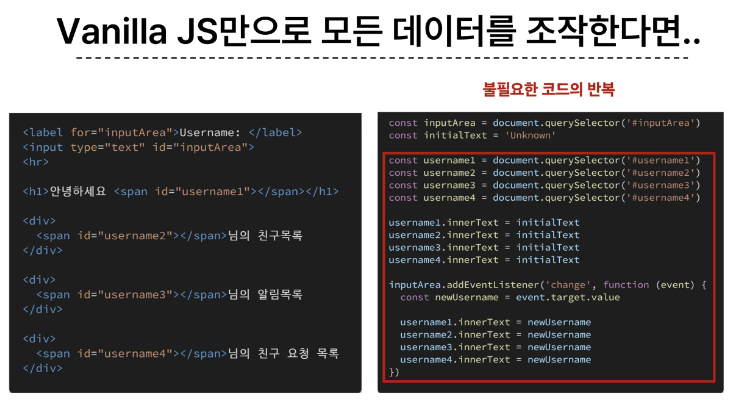

## SPA

### Single Page Application(SPA)
- 페이지 한 개로 구성된 웹 애플리케이션

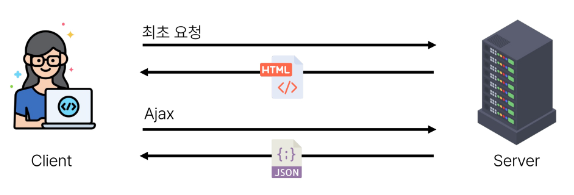

1. 서버로부터 필요한 모든 정적 HTML을 처음에 한번 가져옴
2. 브라우저가 페이지를 로드하면 Vue 프레임워크는 각 HTML 요소에 적절한 JavaScript코드를 실행(이벤트에 응답, 데이터 요청 후 UI 업데이트 등)
   - ex) 페이지 간 이동 시, 페이지 갱신에 필요한 데이터만을 JSON으로 전달받아 페이지 일부 갱신
   - Google Maps, 인스타그램 등의 서비스에서 갱신 시 새로고침이 없는 이유
- 웹 애플리케이션의 초기 로딩 후 새로운 페이지 요청 없이 동적으로 화면을 갱신하며 사용자와 상호작용하는 웹 애플리케이션
  - CSR 방식

### Clinet-side Rendering(CSR)
- 클라이언트에서 화면을 렌더링 하는 방식
1. 브라우저는 페이지에 필요한 최소한의 HTML 페이지와 JavaScript를 다운로드
2. JavaScript를 사용하여 DOM을 업데이트하고 페이지를 렌더링

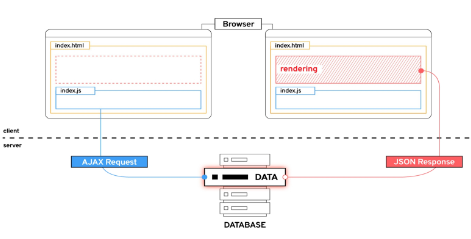

### Client-side Rendering 장점
1. 빠른 속도
   - 페이지의 일부를 다시 렌더링할 수 있으므로 동일한 웹 사이트의 다른 페이지로 이동하는 것이 일반적으로 더 빠름
   - 서버로 전송되는 데이터의 양을 최소화
2. 사용자 경험
   - 새로고침이 발생하지 않아 네이티브 앱과 유사한 사용자 경험을 제공
3. Front-end와 Back-end의 명확한 분리
   - Front-end는 UI 렌더링 및 사용자 상호 작용 처리를 담당 & Back-end는 데이터 및 API 제공을 담당
   - 대규모 애플리케이션을 더 쉽게 개발하고 유지 관리 가능

### Client-side Rendering 단점
1. 초기 구동속도가 느림
   - 전체 페이지를 보기 전에 약간의 지연을 느낄 수 있음
   - JavaScript가 다운로드, 구문 분석 및 실행될 때까지 페이지가 완전히 렌더링 되지 않기 때문
2. SEO(검색 엔진 최적화) 문제
   - 페이지를 나중에 그려 나가는 것이기 때문에 검색에 잘 노출되지 않을 수 있음

<br>
<br>

# 2. Vue

## Vue란?
- 사용자 인터페이스를 구축하기 위한 JavaScript 프레임워크
- 2014년 발표 - Evan you
- 2023년 기준 최신 버전 => Vue 3
  - https://vuejs.org/
- Vue 2 문서에 접속하지 않도록 주의

### Vue를 학습하는 이유
1. 쉬운 학습 곡선 및 간편한 문법
   - 새로운 개발자들도 빠르게 학습할 수 있음
2. 반응성 시스템
   - 데이터 변경에 따라 자동으로 화면이 업데이트되는 기능을 제공
3. 모듈화 및 유연한 구조
   - 애플리케이션을 컴포넌트 조각으로 나눌 수 있음
   - 코드의 재사용성을 높이고 유지보수를 용이하게 함

### SSAFY에서의 Vue
- Vue는 React나 Angular 대비 간결하고 직관적인 문법을 가지고 있어 초기 학습이 상대적으로 원할
  - 짧은 시간내에 효율적으로 결과물을 만들어 낼 수 있음
- 거대하고 활발한 커뮤니티를 가지고 있어 풍부한 문서, 튜토리얼, 예제 및 다양한 리소스를 공유 받을 수 있음
  - 최신 업데이트 및 트렌드를 공유함으로써 지속적인 학습을 촉진

### Vue의 2가지 핵심 기능
- 첫 코드 작성 및 결과

  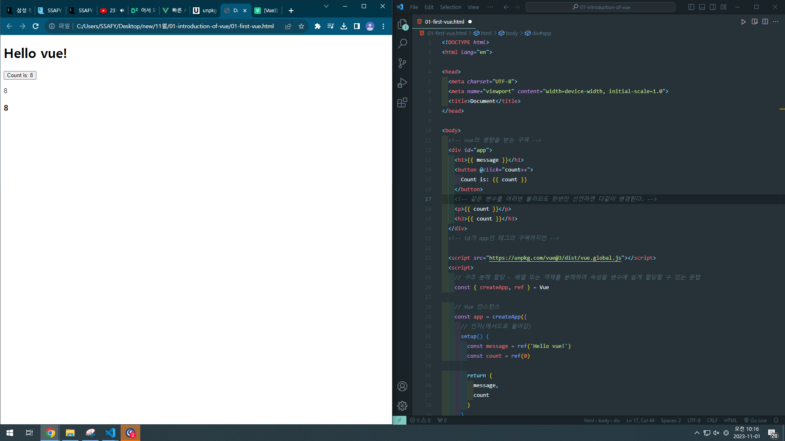

1. 선언적 렌더링(Declarative Rendering)
   - HTML을 확장하는 템플릿 구문을 사용하여 HTML이 JavaScript 데이터를 기반으로 어떻게 보이는지 설명할 수 있음
2. 반응형(Reactivity)
   - JavaScript 상태 변경사항을 자동으로 추적하고 변경사항이 발생할 때 DOM을 효율적으로 업데이트

## Vue Tutorial

### Vue를 사용하는 방법
1. 'CDN' 방식
2. 'NPM' 설치 방식
   - CDN 방식 이후 진행

### 첫번째 Vue 작성하기
- CDN 및 Application instance 작성
- Application instance
  - 모든 Vue 애플리케이션은 createApp 함수로 새 Application instance를 생성하는 것으로 시작
  ```html
  <!-- vue-instance.html -->

  <script src="https://unpkg.com/vue@3/dist/vue.global.js"></script>
  <script>
    const { createApp } = Vue

    const app = createApp({})
  </script>
  ```
- app.mount() (mount: 탑재하다)
  - 컨테이너 요소에 애플리케이션 인스턴스를 탑재(연결)
  - 각 앱 인스턴스에 대해 mount()는 **한 번만 호출**할 수 있음
  ```html
  <!-- vue-instance.html -->
  
  ...
  <!-- 여기서 만든 것을 -->
  <div id="app"></div> 

  <script src="https://unpkg.com/vue@3/dist/vue.global.js"></script>
  <script>
    const { createApp } = Vue

    const app = createApp({})

    <!-- 여기서 탑재 -->
    app.mount('#app')
  </script>
  ```

### ref()
- 반응형 상태(데이터)를 선언하는 함수(Declaring Reactive State)
  - 반응형을 가지는 참조 변수를 만드는 것
  - (ref === reactive reference)
- 인자를 받아 .value 속성이 있는 ref 객체로 래핑(wrapping)하여 반환
- ref로 선언된 변수의 값이 변경되면, 해당 값을 사용하는 템플릿에서 자동으로 업데이트
- 인자는 어떠한 타입도 가능

  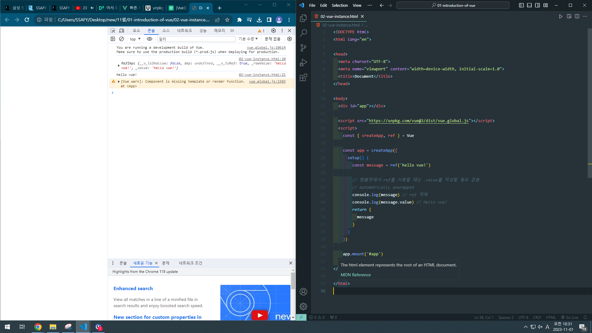

- 템플릿의 참조에 접근하려면 setup 함수에서 선언 및 반환 필요
- 템플릿에서 ref를 사용할 때는 .value를 작성할 필요 없음(automatically unwrapped)

### Vue 기본 구조
- createApp()에 전달되는 객체는 Vue 컴포넌트(Component)
- 컴포넌트의 상태는 setup() 함수 내에서 선언되어야 하며 **객체를 반환해야 함**
  
  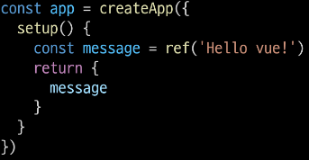

### 템플릿 렌더링
- 반환된 객체의 속성은 템플릿에서 사용할 수 있음
- Mustache syntax(콧수염 구문)을 사용하여 메시지 값을 기반으로 동적 텍스트를 렌더링
  
  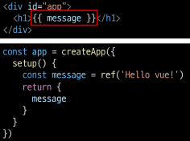

- 콘텐츠는 식별자나 경로에만 국한되지 않으며 유효한 JavaScript표현식을 사용할 수 있음
  
  

### Event Listeners in Vue
- 'v-on' directive를 사용하여 DOM 이벤트를 수신할 수 있음
  - addEventListener(JS)
- 함수 내에서 refs를 변경하여 구성 요소 상태를 업데이트

  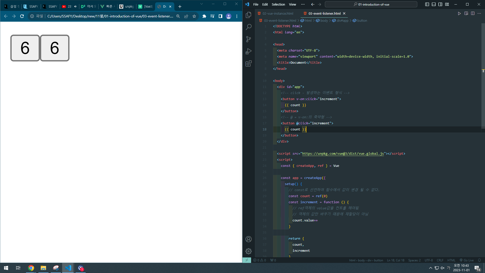

<br>
<br>

# 참고

## Ref Unwrap 주의사항

### 템플릿에서의 unwrap 시 주의사항


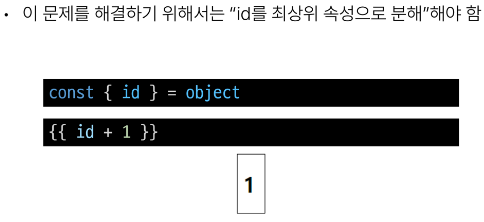


### Why Refs?
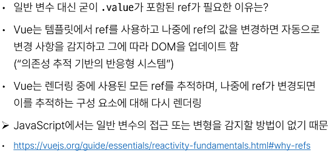

### SEO(Search Engine Optimization)
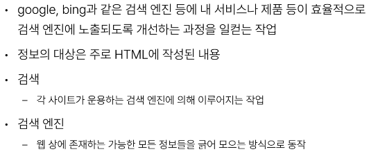


### CSR & SSR


### ref를 사용하는 이유
